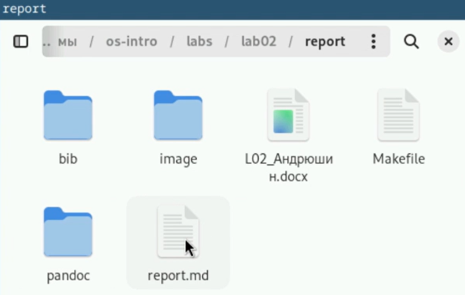
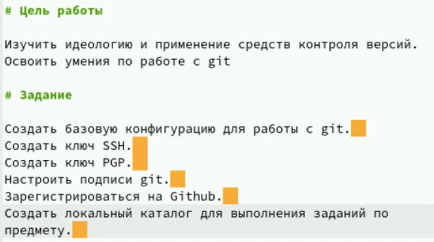
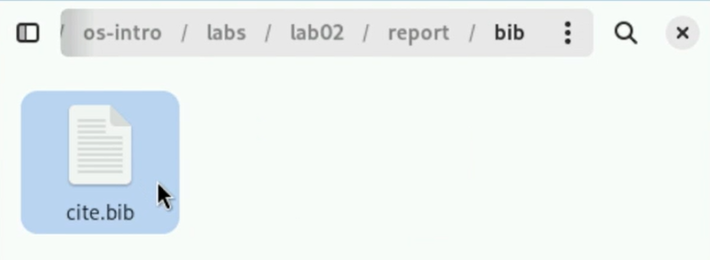
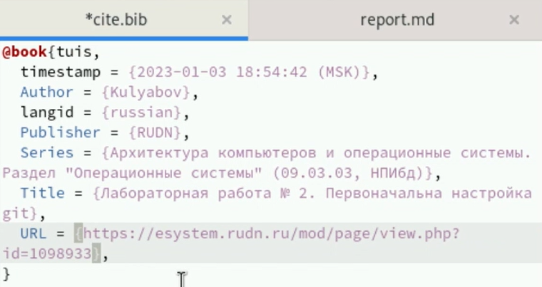

---
## Front matter
lang: ru-RU
title: Лабораторная работа №3
subtitle: Презентация
author:
  - Андрюшин Н. С.
institute:
  - Российский университет дружбы народов, Москва, Россия
date: 25 февраля 2024

## i18n babel
babel-lang: russian
babel-otherlangs: english

## Formatting pdf
toc: false
toc-title: Содержание
slide_level: 2
aspectratio: 169
section-titles: true
theme: metropolis
header-includes:
 - \metroset{progressbar=frametitle,sectionpage=progressbar,numbering=fraction}
 - '\makeatletter'
 - '\beamer@ignorenonframefalse'
 - '\makeatother'
 
## Fonts
mainfont: PT Serif
romanfont: PT Serif
sansfont: PT Sans
monofont: PT Mono
mainfontoptions: Ligatures=TeX
romanfontoptions: Ligatures=TeX
sansfontoptions: Ligatures=TeX,Scale=MatchLowercase
monofontoptions: Scale=MatchLowercase,Scale=0.9
---

# Информация

## Докладчик

:::::::::::::: {.columns align=center}
::: {.column width="70%"}

  * Андрюшин Никита Сергеевич
  * Студент
  * Российский университет дружбы народов
  * [1132231848@pfur.ru](mailto:1132231848@pfur.ru)

:::
::: {.column width="30%"}

:::
::::::::::::::

## Цель

Научиться оформлять отчёты с помощью легковесного языка разметки Markdown. 

## Задачи

Сделать отчёт по предыдущей лабораторной работе в формате Markdown.  
В качестве отчёта предоставить отчёты в 3 форматах: pdf, docx и md (в архиве,
поскольку он должен содержать скриншоты, Makefile и т.д.)

## Открытие файла report.md

Для начала необходимо открыть файл отчёта "report.md" для заполнения

{height=60%}

## Написание титульного листа

Поменяем титульный лист, указав автора отчёта и его название

## Написание цели и задач

Добавим в файл цель работы и задания 

{height=60%}

## Написание раздела "Выполнение лабораторной работы"

И начнём копировать текст из предыдущего отчёта в файл markdown. При этом мы подписываем скриншоты, и иногда меняем их ширину и высоту. Также, мы обозначаем идентификаторы картинок (Решётка + fig:XXX), и ссылки на них ("-" + "@" + fig:XXX) 

{height=40%}

## Открытие файла "cite.bib"

Теперь откроем файл "cite.bib", в котором хранятся источники информации

## Заполнение файла с библиографией

Заполним его, указав в нём список литературы. В данном случае я укажу ссылку на ресурс в ТУИСе

{height=60%}

## Добавление перекрёстных ссылок

И добавим перекрёстную ссылку в тексе

## Выводы

В результате выполнения лабораторной работы были получены навыки создания отчётов в формате .md
