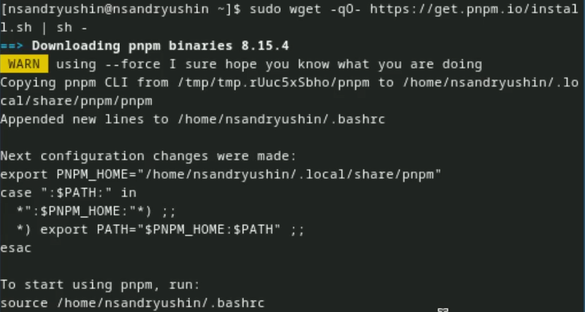
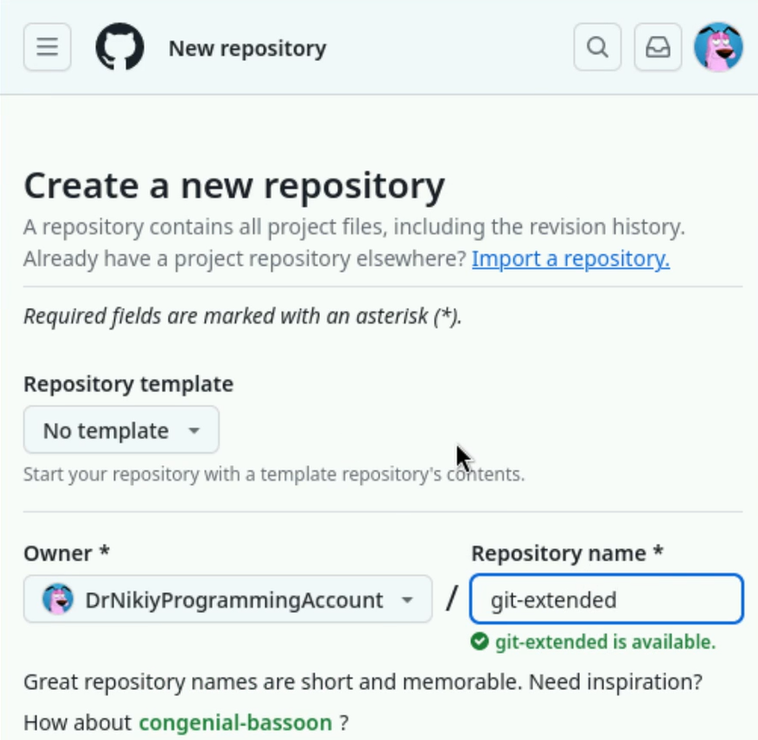
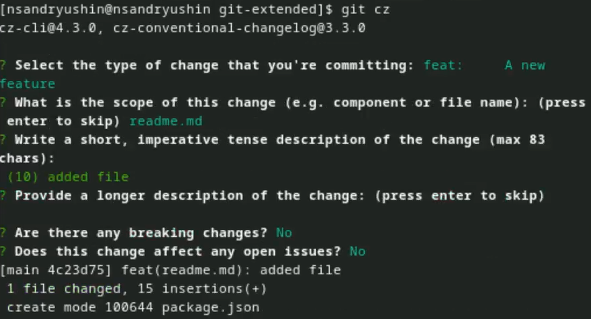
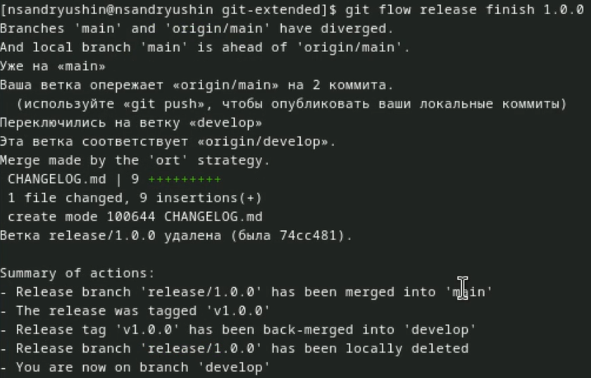
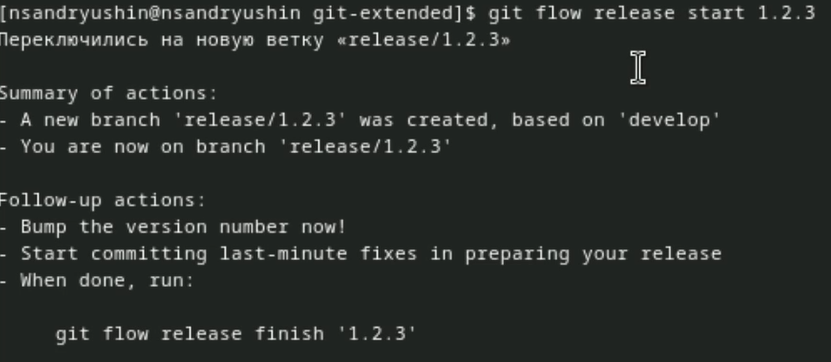
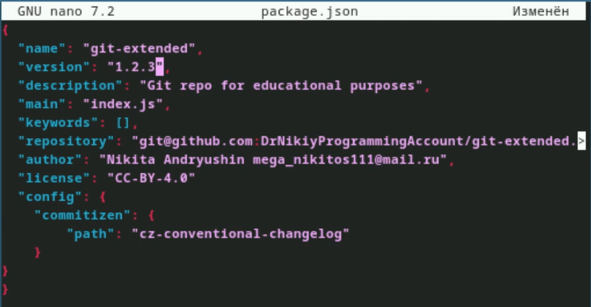

---
## Front matter
lang: ru-RU
title: Лабораторная работа №4
subtitle: Презентация
author:
  - Андрюшин Н. С.
institute:
  - Российский университет дружбы народов, Москва, Россия
date: 25 февраля 2024

## i18n babel
babel-lang: russian
babel-otherlangs: english

## Formatting pdf
toc: false
toc-title: Содержание
slide_level: 2
aspectratio: 169
section-titles: true
theme: metropolis
header-includes:
 - \metroset{progressbar=frametitle,sectionpage=progressbar,numbering=fraction}
 - '\makeatletter'
 - '\beamer@ignorenonframefalse'
 - '\makeatother'
 
## Fonts
mainfont: PT Serif
romanfont: PT Serif
sansfont: PT Sans
monofont: PT Mono
mainfontoptions: Ligatures=TeX
romanfontoptions: Ligatures=TeX
sansfontoptions: Ligatures=TeX,Scale=MatchLowercase
monofontoptions: Scale=MatchLowercase,Scale=0.9
---

# Информация

## Докладчик

:::::::::::::: {.columns align=center}
::: {.column width="70%"}

  * Андрюшин Никита Сергеевич
  * Студент
  * Российский университет дружбы народов
  * [1132231848@pfur.ru](mailto:1132231848@pfur.ru)

:::
::: {.column width="30%"}

:::
::::::::::::::

## Цель

Получение навыков правильной работы с репозиториями git

## Задачи

Выполнить работу для тестового репозитория.
Преобразовать рабочий репозиторий в репозиторий с git-flow и conventional commits.

## Установка ПО

Для начала подключим репозиторий, из которого можно скачать gitflow

{height=50%}

## Установка ПО

После этого установим сам gitflow

{height=50%}

## Установка ПО

Теперь установим NodeJs

{height=50%}

## Установка ПО

Установим pnpm

{height=50%}

## Установка ПО

Запустим pnpm

## Установка ПО

И установим с помощью него Commitizen 

{height=50%}

## Настройка репозитория

Создадим тестовый репозиторий git-extended

{height=50%}

## Настройка репозитория

И клонируем его себе на компьютер

## Настройка репозитория

Создадим какой-нибудь файл и проиндексируем его с помощью git add

## Настройка репозитория

Теперь сделаем соответствующий коммит

## Настройка репозитория

И добавим ветку

## Настройка репозитория

Теперь запушим её обратно на гитхаб

## Продвинутое создание коммитов

Теперь проинициализируем pnpm 

{height=50%}

## Продвинутое создание коммитов

После инициализации создастся файл package.json, который нужно изменить следующим образом

{height=50%}

## Продвинутое создание коммитов

Сделаем коммит, но уже с помощью cz

{height=50%}

## Продвинутое создание коммитов

Загрузим изменения на гитхаб

## Использование gitflow

Теперь проинициализируем gitflow. Укажем названия веток и префикс для версий

{height=50%}

## Использование gitflow

Выведем список веток и убедимся, что мы находимся в develop, и запушим изменения на сервер

{height=50%}

## Использование gitflow

Переключимся на ветку develop, после чего создадим ветку релиза, где создадим changelog

{height=50%}

## Использование gitflow

Проиндексируем changelog и сделаем коммит

## Использование gitflow

Теперь сольём ветку release с веткой develop

{height=50%}

## Использование gitflow

Загрузим изменения в гитхаб

{height=50%}

## Использование gitflow

Создадим релиз из changelog'а

## Работа с релизами

Создадим ветку feature и сразу сольём её с develop 

{height=50%}

## Работа с релизами

Создадим ветку релиза

{height=50%}

## Работа с релизами

И в package.json сменим версию

{height=50%}

## Работа с релизами

Теперь создадим журнал изменений, проиндексируем его и сольём ветку с ним в ветку develop

{height=50%}

## Работа с релизами

Загрузим изменения в гитхаб и создадим релиз 

{height=50%}

## Выводы

В результате выполнения лабораторной работы были получены навыки работы с расширенными возможностями git, а также были созданы релизы к репозиторию и дополнительные ветки, которые автор научился сливать воедино
