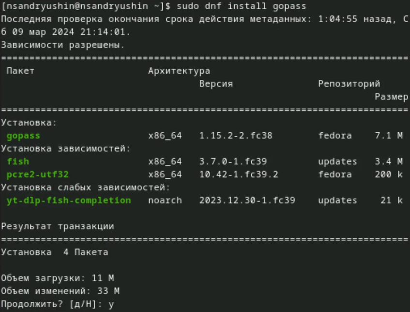
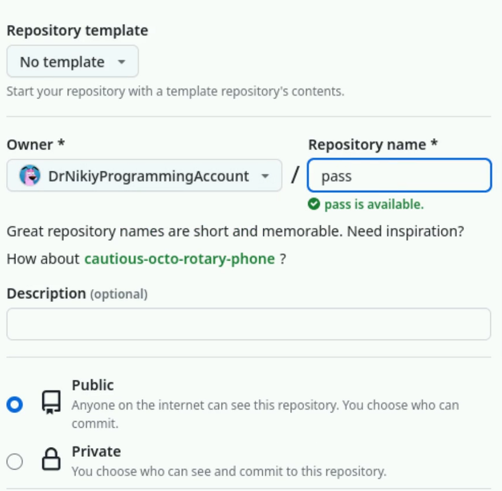
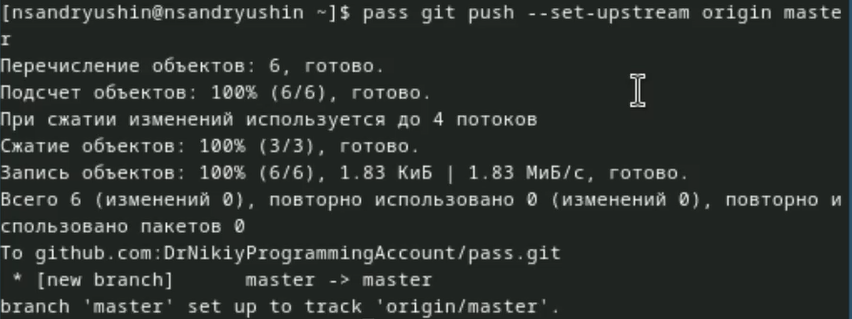
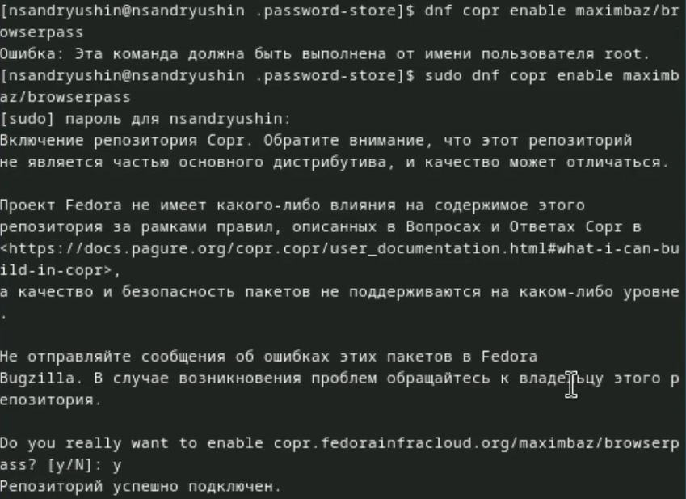
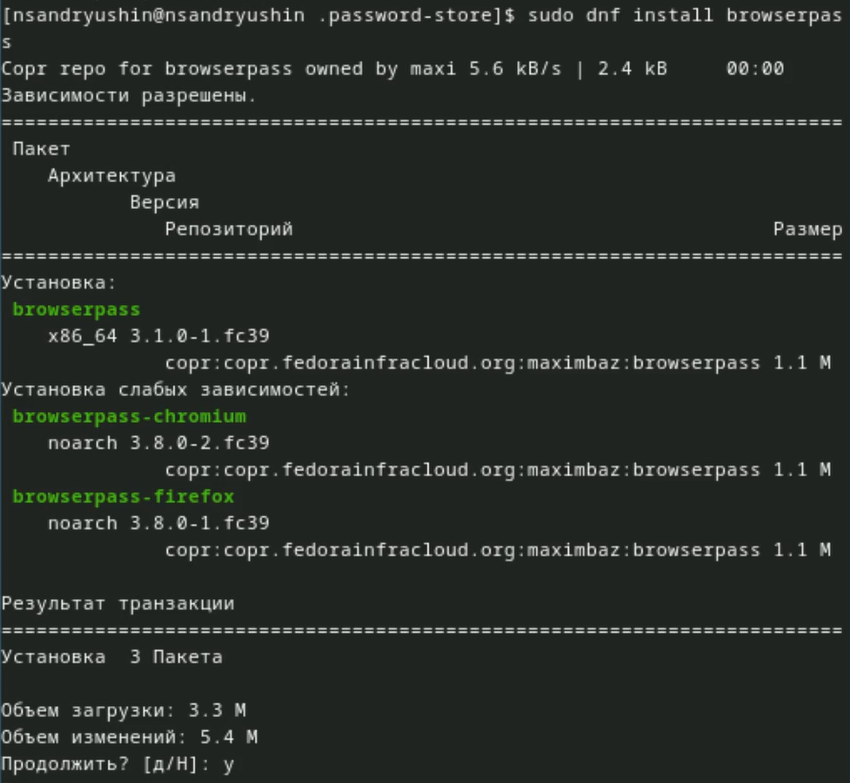
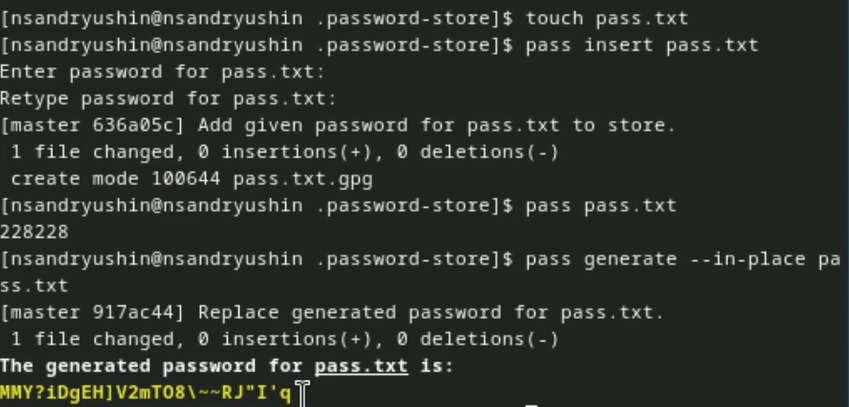
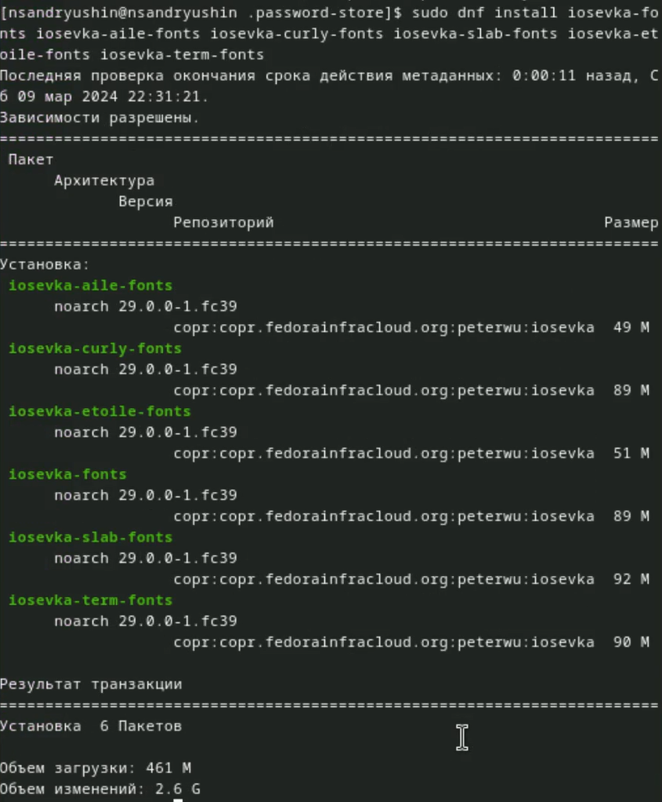

---
## Front matter
title: "Лабораторная работа №5"
subtitle: "Отчёт"
author: "Андрюшин Никита Сергеевич"

## Generic otions
lang: ru-RU
toc-title: "Содержание"

## Bibliography
bibliography: bib/cite.bib
csl: pandoc/csl/gost-r-7-0-5-2008-numeric.csl

## Pdf output format
toc: true # Table of contents
toc-depth: 2
lof: true # List of figures
lot: true # List of tables
fontsize: 12pt
linestretch: 1.5
papersize: a4
documentclass: scrreprt
## I18n polyglossia
polyglossia-lang:
  name: russian
  options:
	- spelling=modern
	- babelshorthands=true
polyglossia-otherlangs:
  name: english
## I18n babel
babel-lang: russian
babel-otherlangs: english
## Fonts
mainfont: PT Serif
romanfont: PT Serif
sansfont: PT Sans
monofont: PT Mono
mainfontoptions: Ligatures=TeX
romanfontoptions: Ligatures=TeX
sansfontoptions: Ligatures=TeX,Scale=MatchLowercase
monofontoptions: Scale=MatchLowercase,Scale=0.9
## Biblatex
biblatex: true
biblio-style: "gost-numeric"
biblatexoptions:
  - parentracker=true
  - backend=biber
  - hyperref=auto
  - language=auto
  - autolang=other*
  - citestyle=gost-numeric
## Pandoc-crossref LaTeX customization
figureTitle: "Рис."
tableTitle: "Таблица"
listingTitle: "Листинг"
lofTitle: "Список иллюстраций"
lotTitle: "Список таблиц"
lolTitle: "Листинги"
## Misc options
indent: true
header-includes:
  - \usepackage{indentfirst}
  - \usepackage{float} # keep figures where there are in the text
  - \floatplacement{figure}{H} # keep figures where there are in the text
---

# Цель работы

Научиться пользоваться pass и chezmoi [@tuis]

# Задание

Настроить ОС, синхронизируя её с данной.  
Научиться использовать программы для управления паролями 

# Выполнение лабораторной работы

Для начала необходимо скачать pass и pass-opt (рис. [-@fig:001])

{#fig:001}

Уставновим gopass (рис. [-@fig:002])

{#fig:002}

Выведем список pgp ключей (рис. [-@fig:003])

{#fig:003}

Проинициализируем pass, указав свой email (рис. [-@fig:004])

{#fig:004}

Проинициализируем репозиторий в git для pass (рис. [-@fig:005])

{#fig:005}

Создадим репозиторий pass (рис. [-@fig:006])

{#fig:006}

Пробуем получить данные (рис. [-@fig:007])
 
{#fig:007}

Но не получаем, так как репозиторий пуст. Выложим изменения на Github (рис. [-@fig:008])
 
{#fig:008}

Теперь снова пробуем получить данные (рис. [-@fig:009])
 
{#fig:009}

Сделаем пустой коммит и выложим его (рис. [-@fig:010])
 
{#fig:010}

Проверим статус pass репозитория (рис. [-@fig:011])
 
{#fig:011}

Подключим репозиторий для скачивания browserpass (рис. [-@fig:012])
 
{#fig:012}

Установим browserpass (рис. [-@fig:013])
 
{#fig:013}

и установим его в браузере (рис. [-@fig:014])
 
{#fig:014}

Создадим файл с паролем (рис. [-@fig:015])
 
{#fig:015}

И установим дополнительные пакеты (рис. [-@fig:016])
 
{#fig:016}

Подключим репозиторий для скачивания шрифтов (рис. [-@fig:017])
 
{#fig:017}

Найдём шрифты (рис. [-@fig:018])
 
{#fig:018}

И установим (рис. [-@fig:019])
 
{#fig:019}

Установим chezmoi (рис. [-@fig:020])
 
{#fig:020}

Создадим репозиторий из шаблона (рис. [-@fig:021])
 
{#fig:021}

проинициализируем chezmoi, указав только что созданный репозиторий (рис. [-@fig:022])
 
{#fig:022}

Посмотрим на изменения (рис. [-@fig:023])
 
{#fig:023}

И согласимся с ними (рис. [-@fig:024])
 
{#fig:024}

Проинициализируем Chezmoi на второй машине (рис. [-@fig:025])
 
{#fig:025}

Посмотрим на изменения (рис. [-@fig:026])
 
{#fig:026}

И согласимся с ними (рис. [-@fig:027])
 
{#fig:027}

Обновим изменения (рис. [-@fig:028])
 
{#fig:028}

Согласимся с ними (рис. [-@fig:029])
 
{#fig:029}

Извлечём изменения из репозитория (рис. [-@fig:030])
 
{#fig:030}

И отредактируем конфигурационный файл, чтобы автоматически фиксировать и отправлять изменения в исходный каталог в репозиторий (рис. [-@fig:031])
 
{#fig:031}

# Выводы

В результате выполнения лабораторной работы были настроены программы для управления паролями, а также появился навык синхронизации настроек ОС

# Список литературы{.unnumbered}

::: {#refs}
:::
