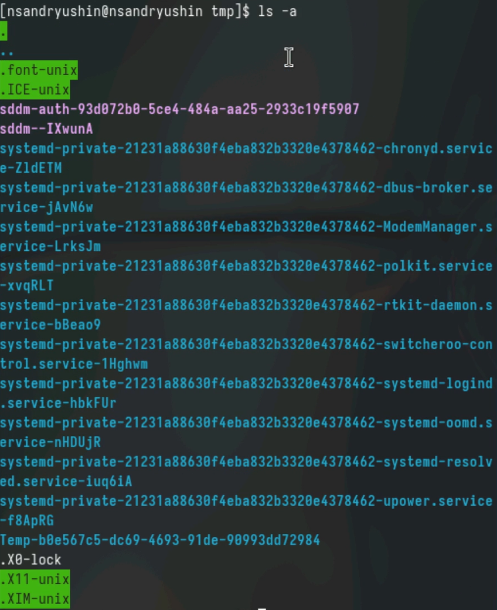
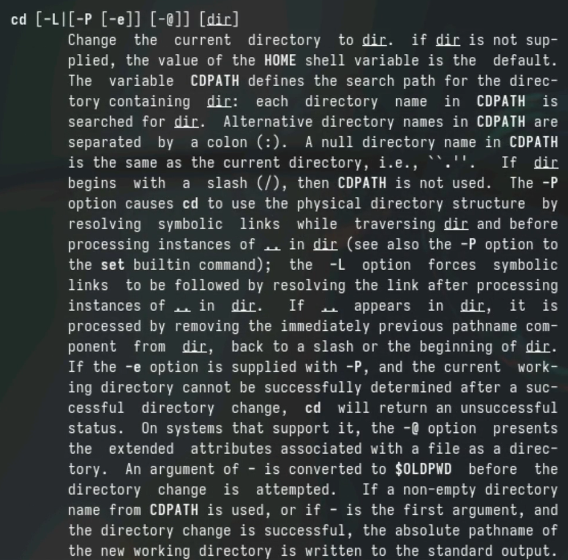
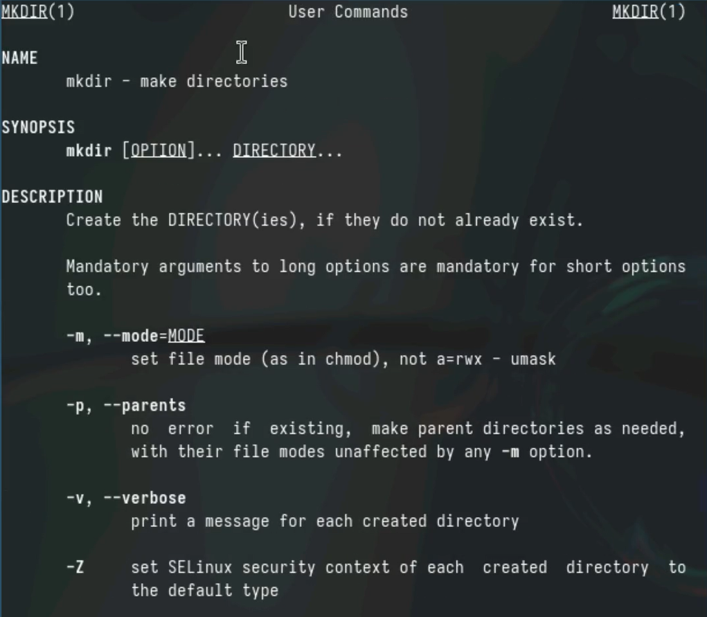
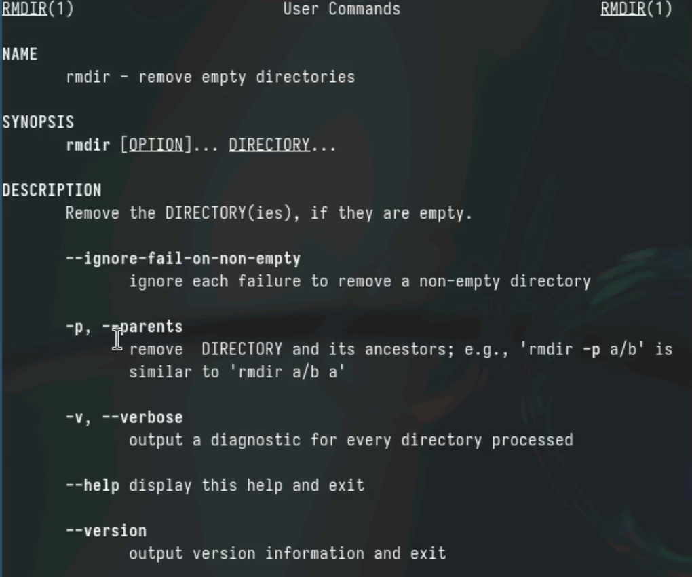
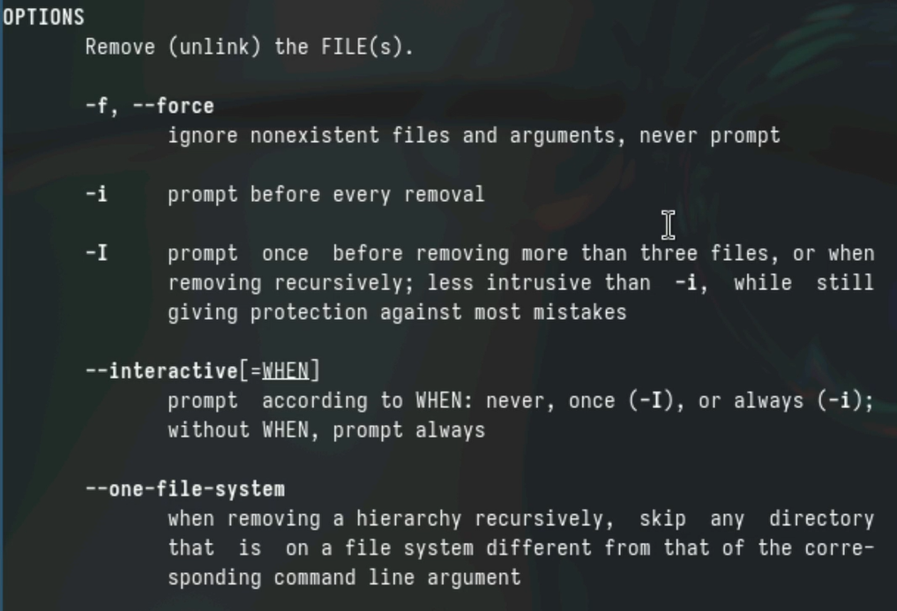
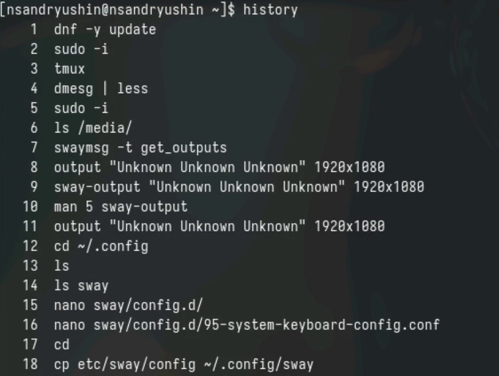
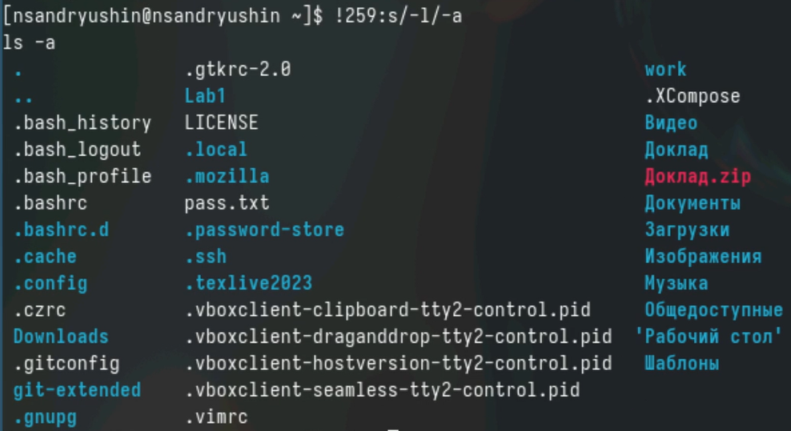

---
## Front matter
lang: ru-RU
title: Лабораторная работа №6
subtitle: Презентация
author:
  - Андрюшин Н. С.
institute:
  - Российский университет дружбы народов, Москва, Россия
date: 12 марта 2024

## i18n babel
babel-lang: russian
babel-otherlangs: english

## Formatting pdf
toc: false
toc-title: Содержание
slide_level: 2
aspectratio: 169
section-titles: true
theme: metropolis
header-includes:
 - \metroset{progressbar=frametitle,sectionpage=progressbar,numbering=fraction}
 - '\makeatletter'
 - '\beamer@ignorenonframefalse'
 - '\makeatother'

## Fonts
mainfont: PT Serif
romanfont: PT Serif
sansfont: PT Sans
monofont: PT Mono
mainfontoptions: Ligatures=TeX
romanfontoptions: Ligatures=TeX
sansfontoptions: Ligatures=TeX,Scale=MatchLowercase
monofontoptions: Scale=MatchLowercase,Scale=0.9
---

# Информация

## Докладчик

:::::::::::::: {.columns align=center}
::: {.column width="70%"}

  * Андрюшин Никита Сергеевич
  * Студент
  * Российский университет дружбы народов
  * [1132231848@pfur.ru](mailto:1132231848@pfur.ru)

:::
::: {.column width="30%"}

:::
::::::::::::::

## Цель

Приобретение практических навыков взаимодействия пользователя с системой посредством командной строки

## Задачи

1. Определите полное имя вашего домашнего каталога. Далее относительно этого каталога будут выполняться последующие упражнения.  
2. Выполните следующие действия:  
2.1. Перейдите в каталог /tmp.  
2.2. Выведите на экран содержимое каталога /tmp. Для этого используйте команду ls с различными опциями. Поясните разницу в выводимой на экран информации.  
2.3. Определите, есть ли в каталоге /var/spool подкаталог с именем cron?  
2.4. Перейдите в Ваш домашний каталог и выведите на экран его содержимое. Определите, кто является владельцем файлов и подкаталогов?  

## Задачи

3. Выполните следующие действия:  
3.1. В домашнем каталоге создайте новый каталог с именем newdir.  
3.2. В каталоге ~/newdir создайте новый каталог с именем morefun.  
3.3. В домашнем каталоге создайте одной командой три новых каталога с именами letters, memos, misk. Затем удалите эти каталоги одной командой.  
3.4. Попробуйте удалить ранее созданный каталог ~/newdir командой rm. Проверьте, был ли каталог удалён.  
3.5. Удалите каталог ~/newdir/morefun из домашнего каталога. Проверьте, был ликаталог удалён.  

## Задачи

4. С помощью команды man определите, какую опцию команды ls нужно использовать для просмотра содержимое не только указанного каталога, но и подкаталогов, входящих в него.  
5. С помощью команды man определите набор опций команды ls, позволяющий отсортировать по времени последнего изменения выводимый список содержимого каталога с развёрнутым описанием файлов.  
6. Используйте команду man для просмотра описания следующих команд: cd, pwd, mkdir, rmdir, rm. Поясните основные опции этих команд.  
7. Используя информацию, полученную при помощи команды history, выполните модификацию и исполнение нескольких команд из буфера команд.  

## Определение имени каталога

Для начала посмотрим полный путь для нашего каталога

## Переход в /tmp

Далее, перейдём в каталог /tmp и просмотрим его содержимое

{height=60%}

## ls

С помощью ключа -a выведем и дополнительные файлы

{height=60%}

## ls

Теперь выведем файлы с полной информацией с помощью ключа -l

{height=60%}

## ls

Теперь выведем типы элементов с помощью -F 

{height=60%}

## ls

Используем все 3 ключа сразу 

{height=60%}

## Содержимое /var/spool

Посмотрим, есть ли в каталоге /var/spool каталог cron. Как видим, он есть 

## подробный просмотр содержимого

Перейдём в домашнюю директорию и выведем подробный список файлов и посмотрим, кому они принадлежат. Как мы видим, они принадлежат моему пользователю

{height=60%}

## Создание и удаление директорий

Создадим каталог newdir. Внутри него создадим каталог morefun. Создадим каталоги letters memos и misk одной коммандой. Попробуем удалить newdir с помощью rm. Не получилось, так как это каталог. Удалим его дочерний элемент с помощью rmdir. Удаление прошло успешно 

## Ключи

Посмотрим с помощью man, какой ключ для вывода всех подкаталогов. Это ключ -R

## Ключи

Посмотрим теперь ключ для вывода элементов по времени 

## Ключи и man

Посмотрим существующие ключи для cd. Основных 3 - p, l и e

{height=60%}

## Ключи и man

Посмотрим ключи для mkdir. Основные - m (Поставить права доступа), p (Создать родительские каталоги), v (Подробно выводить каждое действие) и z (поставить защиту в стандартный режим)

{height=60%}

## Ключи и man

Посмотрим ключи для pwd. Основные - l (использовать pwd из окружения), p (избегать символьных ссылок) 

{height=60%}

## Ключи и man

Посмотрим ключи для rmdir. Основные -  p (Удалить родительские каталоги), v (Подробно выводить каждое действие) 

{height=60%}

## Ключи и man

Посмотрим ключи для rm. Основные -  f (принудительно удалять), i (спрашивать подтверждение) 

{height=60%}

## history

Выведем историю команд

{height=60%}

## history

Примеры использования изменённых из истории команд

{height=60%}

## history

{height=60%}

## history

## Выводы

В результате выполнения работы были получены навыки работы с базовыми командами терминала
