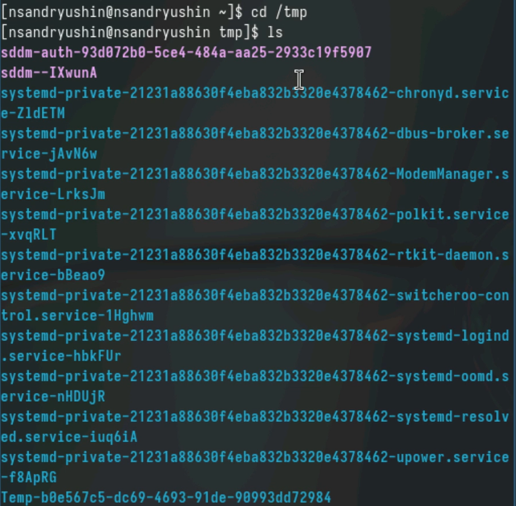
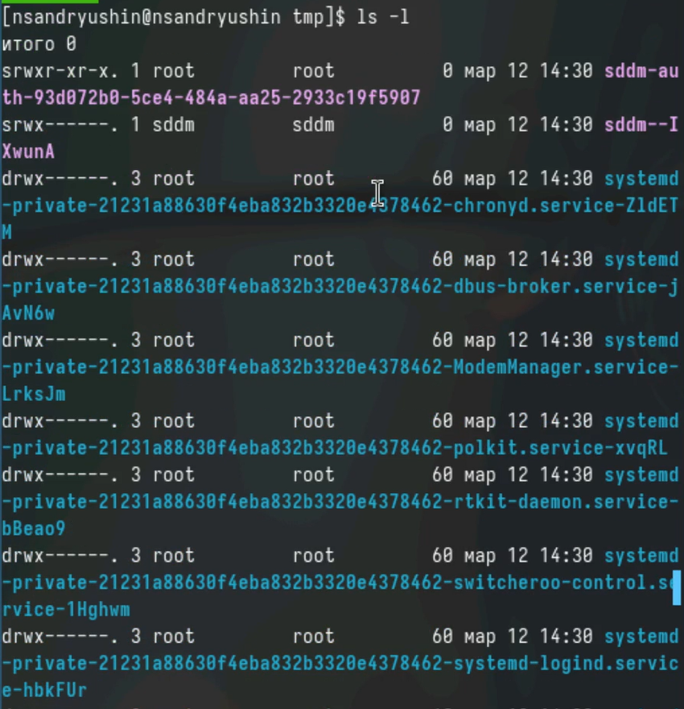
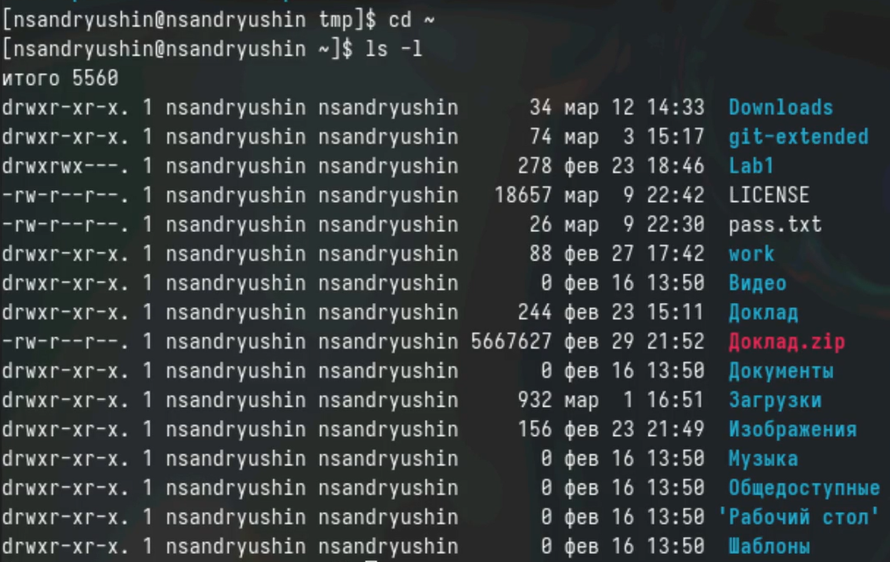
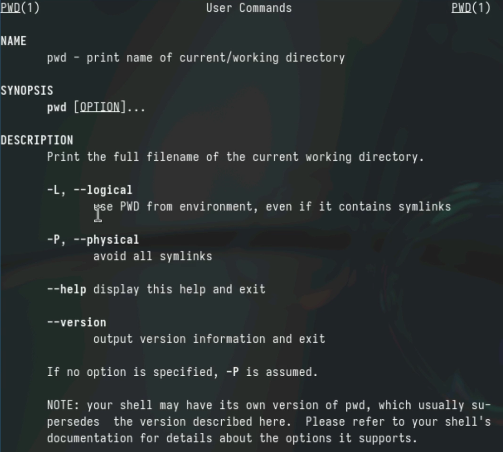

---
## Front matter
title: "Лабораторная работа №6"
subtitle: "Отчёт"
author: "Андрюшин Никита Сергеевич"

## Generic otions
lang: ru-RU
toc-title: "Содержание"

## Bibliography
bibliography: bib/cite.bib
csl: pandoc/csl/gost-r-7-0-5-2008-numeric.csl

## Pdf output format
toc: true # Table of contents
toc-depth: 2
lof: true # List of figures
lot: true # List of tables
fontsize: 12pt
linestretch: 1.5
papersize: a4
documentclass: scrreprt
## I18n polyglossia
polyglossia-lang:
  name: russian
  options:
	- spelling=modern
	- babelshorthands=true
polyglossia-otherlangs:
  name: english
## I18n babel
babel-lang: russian
babel-otherlangs: english
## Fonts
mainfont: PT Serif
romanfont: PT Serif
sansfont: PT Sans
monofont: PT Mono
mainfontoptions: Ligatures=TeX
romanfontoptions: Ligatures=TeX
sansfontoptions: Ligatures=TeX,Scale=MatchLowercase
monofontoptions: Scale=MatchLowercase,Scale=0.9
## Biblatex
biblatex: true
biblio-style: "gost-numeric"
biblatexoptions:
  - parentracker=true
  - backend=biber
  - hyperref=auto
  - language=auto
  - autolang=other*
  - citestyle=gost-numeric
## Pandoc-crossref LaTeX customization
figureTitle: "Рис."
tableTitle: "Таблица"
listingTitle: "Листинг"
lofTitle: "Список иллюстраций"
lotTitle: "Список таблиц"
lolTitle: "Листинги"
## Misc options
indent: true
header-includes:
  - \usepackage{indentfirst}
  - \usepackage{float} # keep figures where there are in the text
  - \floatplacement{figure}{H} # keep figures where there are in the text
---

# Цель работы

Приобретение практических навыков взаимодействия пользователя с системой посредством командной строки [@tuis]

# Задание

1. Определите полное имя вашего домашнего каталога. Далее относительно этого каталога будут выполняться последующие упражнения.  
2. Выполните следующие действия:  
2.1. Перейдите в каталог /tmp.  
2.2. Выведите на экран содержимое каталога /tmp. Для этого используйте команду ls с различными опциями. Поясните разницу в выводимой на экран информации.  
2.3. Определите, есть ли в каталоге /var/spool подкаталог с именем cron?  
2.4. Перейдите в Ваш домашний каталог и выведите на экран его содержимое. Определите, кто является владельцем файлов и подкаталогов?  
3. Выполните следующие действия:  
3.1. В домашнем каталоге создайте новый каталог с именем newdir.  
3.2. В каталоге ~/newdir создайте новый каталог с именем morefun.  
3.3. В домашнем каталоге создайте одной командой три новых каталога с именами letters, memos, misk. Затем удалите эти каталоги одной командой.  
3.4. Попробуйте удалить ранее созданный каталог ~/newdir командой rm. Проверьте, был ли каталог удалён.  
3.5. Удалите каталог ~/newdir/morefun из домашнего каталога. Проверьте, был ликаталог удалён.  
4. С помощью команды man определите, какую опцию команды ls нужно использовать для просмотра содержимое не только указанного каталога, но и подкаталогов, входящих в него.  
5. С помощью команды man определите набор опций команды ls, позволяющий отсортировать по времени последнего изменения выводимый список содержимого каталога с развёрнутым описанием файлов.  
6. Используйте команду man для просмотра описания следующих команд: cd, pwd, mkdir, rmdir, rm. Поясните основные опции этих команд.  
7. Используя информацию, полученную при помощи команды history, выполните модификацию и исполнение нескольких команд из буфера команд.  

# Выполнение лабораторной работы

Для начала посмотрим полный путь для нашего каталога (рис. [-@fig:001]).

{#fig:001}

Далее, перейдём в каталог /tmp и просмотрим его содержимое (рис. [-@fig:002]).

{#fig:002}

С помощью ключа -a выведем и дополнительные файлы (рис. [-@fig:003]).

{#fig:003}

Теперь выведем файлы с полной информацией с помощью ключа -l (рис. [-@fig:004]).

{#fig:004}

Теперь выведем типы элементов с помощью -F (рис. [-@fig:005]).

{#fig:005}

Используем все 3 ключа сразу (рис. [-@fig:006]).

{#fig:006}

Посмотрим, есть ли в каталоге /var/spool каталог cron. Как видим, он есть (рис. [-@fig:007]).

{#fig:007}

Перейдём в домашнюю директорию и выведем подробный список файлов и посмотрим, кому они принадлежат. Как мы видим, они принадлежат моему пользователю (рис. [-@fig:008]).

{#fig:008}

Создадим каталог newdir. Внутри него создадим каталог morefun. Создадим каталоги letters memos и misk одной коммандой. Попробуем удалить newdir с помощью rm. Не получилось, так как это каталог. Удалим его дочерний элемент с помощью rmdir. Удаление прошло успешно (рис. [-@fig:009]).

{#fig:009}

Посмотрим с помощью man, какой ключ для вывода всех подкаталогов. Это ключ -R (рис. [-@fig:010]).

{#fig:010}

Посмотрим теперь ключ для вывода элементов по времени (рис. [-@fig:011]).

{#fig:011}

Посмотрим существующие ключи для cd. Основных 3 - p, l и e (рис. [-@fig:012]).

{#fig:012}

Посмотрим ключи для mkdir. Основные - m (Поставить права доступа), p (Создать родительские каталоги), v (Подробно выводить каждое действие) и z (поставить защиту в стандартный режим) (рис. [-@fig:013]).

{#fig:013}

Посмотрим ключи для pwd. Основные - l (использовать pwd из окружения), p (избегать символьных ссылок) (рис. [-@fig:014]).

{#fig:014}

Посмотрим ключи для rmdir. Основные -  p (Удалить родительские каталоги), v (Подробно выводить каждое действие) (рис. [-@fig:015]).

{#fig:015}

Посмотрим ключи для rm. Основные -  f (принудительно удалять), i (спрашивать подтверждение) (рис. [-@fig:016]).

{#fig:016}

Выведем историю команд (рис. [-@fig:017]).

{#fig:017}

Примеры использования изменённых из истории команд (рис. [-@fig:018; -@fig:019; -@fig:020]).

{#fig:018}

{#fig:019}

{#fig:020}

# Выводы

В результате выполнения работы были получены навыки работы с базовыми командами терминала

# Ответы на контрольные вопросы

1. Строка, в которую мы можем писать команды для исполнения  
2. С помощью pwd. Например: pwd Загрузки
3. С помощью ls -F. Например: ls -F /tmp
4. С помощью ls -al. Например: ls -al /var
5. При помощи rm и rmdir соответственно. С помощью rm -R можно удалить как файл, так и каталог. Например: rm -R git-extended
6. С помощью history. Например, history
7. !<номер_команды>:s/<что_меняем>/<на_что_меняем>. Например, !3:s/a/F
8. cd; mkdir newdir; rm file.txt
9. Символы экранирования - специальные символы, которые интерпретируются по другому. Например, !3:s/-a/\/newdir
10. Выводит также владельца, дату, права доступа и название
11. Относительный путь - путь относительно текущего нахождения. Например, cd tmp и cd /tmp - разные по значению команды
12. С помощью man
13. tab

# Список литературы{.unnumbered}

::: {#refs}
:::
