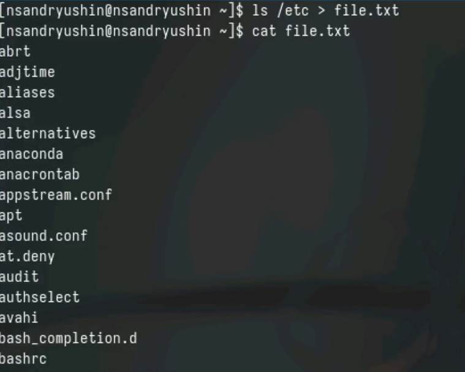
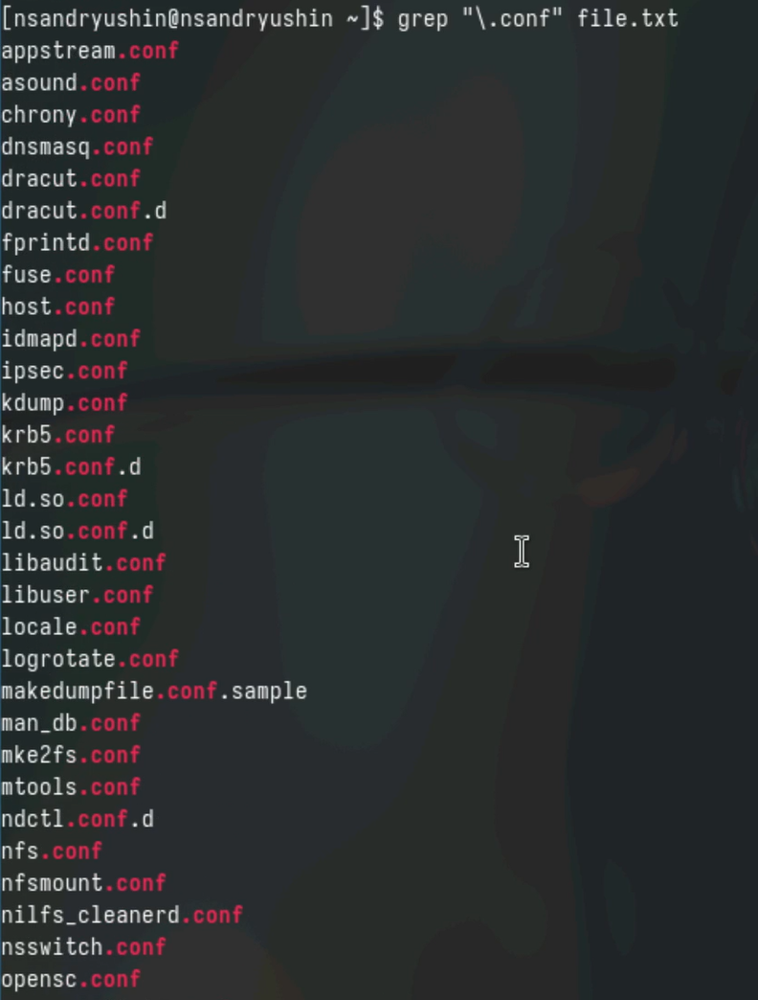
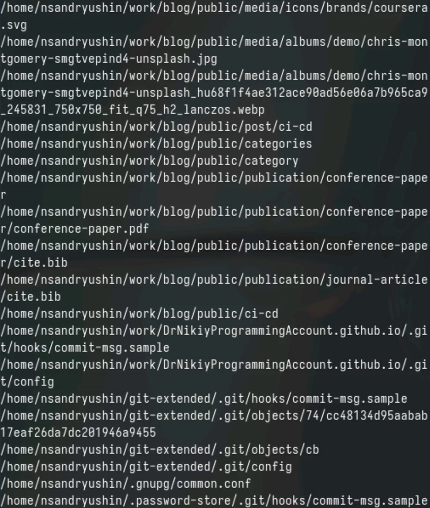
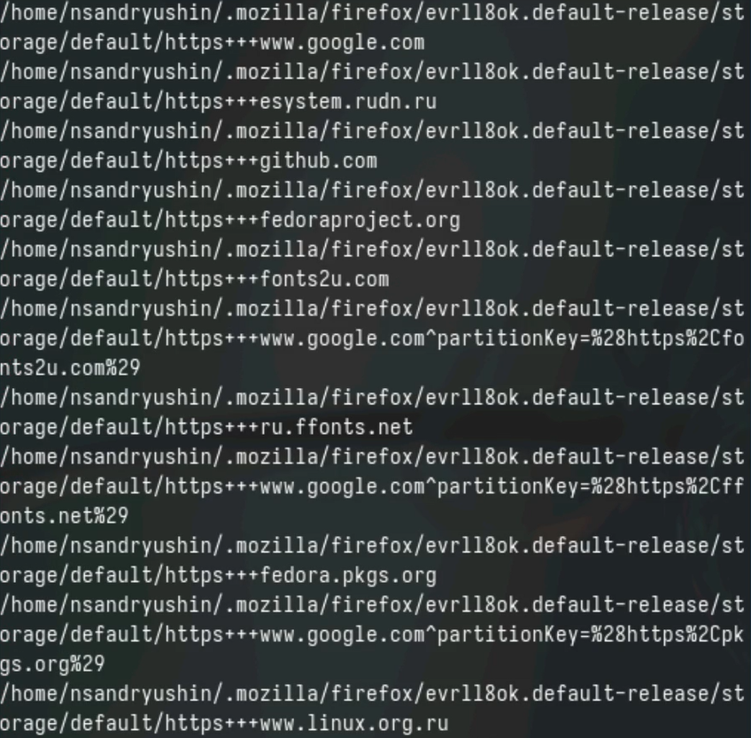
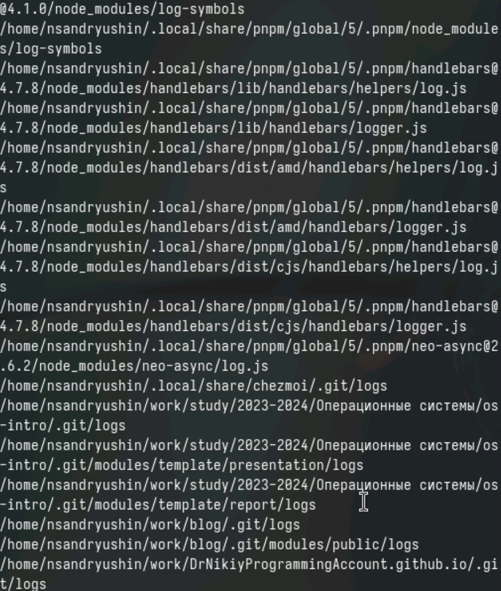
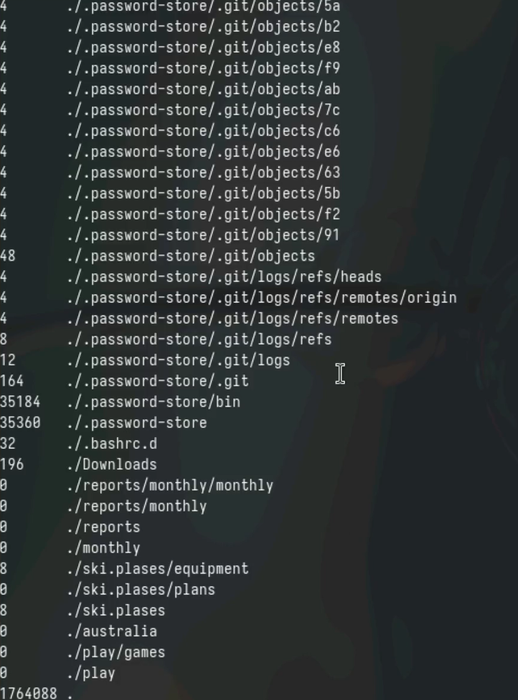

---
## Front matter
title: "Лабораторная работа №8"
subtitle: "Отчёт"
author: "Андрюшин Никита Сергеевич"

## Generic otions
lang: ru-RU
toc-title: "Содержание"

## Bibliography
bibliography: bib/cite.bib
csl: pandoc/csl/gost-r-7-0-5-2008-numeric.csl

## Pdf output format
toc: true # Table of contents
toc-depth: 2
lof: true # List of figures
lot: true # List of tables
fontsize: 12pt
linestretch: 1.5
papersize: a4
documentclass: scrreprt
## I18n polyglossia
polyglossia-lang:
  name: russian
  options:
	- spelling=modern
	- babelshorthands=true
polyglossia-otherlangs:
  name: english
## I18n babel
babel-lang: russian
babel-otherlangs: english
## Fonts
mainfont: PT Serif
romanfont: PT Serif
sansfont: PT Sans
monofont: PT Mono
mainfontoptions: Ligatures=TeX
romanfontoptions: Ligatures=TeX
sansfontoptions: Ligatures=TeX,Scale=MatchLowercase
monofontoptions: Scale=MatchLowercase,Scale=0.9
## Biblatex
biblatex: true
biblio-style: "gost-numeric"
biblatexoptions:
  - parentracker=true
  - backend=biber
  - hyperref=auto
  - language=auto
  - autolang=other*
  - citestyle=gost-numeric
## Pandoc-crossref LaTeX customization
figureTitle: "Рис."
tableTitle: "Таблица"
listingTitle: "Листинг"
lofTitle: "Список иллюстраций"
lotTitle: "Список таблиц"
lolTitle: "Листинги"
## Misc options
indent: true
header-includes:
  - \usepackage{indentfirst}
  - \usepackage{float} # keep figures where there are in the text
  - \floatplacement{figure}{H} # keep figures where there are in the text
---

# Цель работы

Ознакомление с инструментами поиска файлов и фильтрации текстовых данных. Приобретение практических навыков: по управлению процессами (и заданиями), по проверке использования диска и обслуживанию файловых систем. [@tuis]

# Задание

1. Осуществите вход в систему, используя соответствующее имя пользователя.  
2. Запишите в файл file.txt названия файлов, содержащихся в каталоге /etc. Допишите в этот же файл названия файлов, содержащихся в вашем домашнем каталоге.  
3. Выведите имена всех файлов из file.txt, имеющих расширение .conf, после чего запишите их в новый текстовой файл conf.txt.  
4. Определите, какие файлы в вашем домашнем каталоге имеют имена, начинавшиеся с символа c? Предложите несколько вариантов, как это сделать.  
5. Выведите на экран (по странично) имена файлов из каталога /etc, начинающиеся с символа h.  
6. Запустите в фоновом режиме процесс, который будет записывать в файл ~/logfile файлы, имена которых начинаются с log.  
7. Удалите файл ~/logfile.  
8. Запустите из консоли в фоновом режиме редактор gedit.  
9. Определите идентификатор процесса gedit, используя команду ps, конвейер и фильтр grep. Как ещё можно определить идентификатор процесса?  
10. Прочтите справку (man) команды kill, после чего используйте её для завершения процесса gedit.  
11. Выполните команды df и du, предварительно получив более подробную информацию об этих командах, с помощью команды man.  
12. Воспользовавшись справкой команды find, выведите имена всех директорий, имеющихся в вашем домашнем каталоге.  

# Выполнение лабораторной работы

Попробуем перенаправить вывод команды ls в файл c помощью > (рис. [-@fig:001]).

{#fig:001}

Теперь дозапишем в наш файл содержимое нашего домашнего каталога с помощью >> (рис. [-@fig:002]).

{#fig:002}

С помощью grep выведем содержимое нашего файла, куда мы записывали содержимое каталогов, таким образом, чтобы выводились только файлы с расширением conf (рис. [-@fig:003]).

{#fig:003}

Выполним ту же команду, только перенаправим вывод в файл (рис. [-@fig:004]).

{#fig:004}

Найдём в домашнем каталоге файлы, которые начинаются на "c" с помощью команды find (рис. [-@fig:005]).

{#fig:005}

Мы увидем следующее (рис. [-@fig:006]).

{#fig:006}

Теперь выведем постранично файлы, которые начинаются на "h", с помощью того же find. Для этого создадим конвеер, и передадим вывод в команду less (рис. [-@fig:007]).

{#fig:007}

Увидим следующее (рис. [-@fig:008]).

{#fig:008}

Теперь запишем в файл имена файлов, начинающиеся с "log", но в фоновом режиме с помощью & (рис. [-@fig:009]).

{#fig:009}

Содержимое будет выглядеть так (рис. [-@fig:010]).

{#fig:010}

Удалим этот файл (рис. [-@fig:011]).

{#fig:011}

Запустим gedit в фоновом режиме (рис. [-@fig:012]).

{#fig:012}

Посмотрим на pid этого процесса с помощью ps (рис. [-@fig:013]).

{#fig:013}

Убьём процесс gedit по его pid (рис. [-@fig:014]).

{#fig:014}

Посмотрим на размер доступного места в системе с помощью df (рис. [-@fig:015]).

{#fig:015}

И посмотрим на занимаемое место с помощью du (рис. [-@fig:016]).

{#fig:016}

Увидим следующее (рис. [-@fig:017]).

{#fig:017}

Выведем все директории в домашнем каталоге с помощью find, указав в аргументе -type букву "d" (directory) (рис. [-@fig:018]).

{#fig:018}

Увидем следующее (рис. [-@fig:019]).

{#fig:019}

# Контрольные вопросы

1. В системе по умолчанию открыты три особых потока:
stdin — это стандартный поток ввода (по умолчанию это клавиатура), его файловый дескриптор равен 0.  
stdout — это стандартный поток вывода (по умолчанию это консоль), его файловый дескриптор равен 1.  
stderr — это стандартный поток вывода сообщений об ошибках (по умолчанию это консоль), его файловый дескриптор равен 2.  

2. Символ > используется для перенаправления ввода/вывода, а символ » используется для перенаправления в режиме добавления.  

3. Конвейер (pipe) используется для объединения отдельных команд или утилит в цепочку, в которой вывод одной команды передается на вход следующей команды.  

4. Основное различие между программой и процессом заключается в том, что программа представляет собой набор инструкций, предназначенных для выполнения определенной задачи центральным процессором (ЦПУ), в то время как процесс - это экземпляр исполняемой программы, который активно выполняется в операционной системе.  

5. PID (Process ID) - это идентификатор процесса, который уникально идентифицирует каждый запущенный процесс в операционной системе.  
GID (Group ID) - это идентификатор группы, который определяет принадлежность процесса к определенной группе пользователей в операционной системе.  

6. Программы, запущенные в фоновом режиме, действительно называются задачами (jobs). Управлять ими можно с помощью команды jobs, которая выводит список запущенных в данный момент задач.  

7. Команда htop и команда top выполняют аналогичные функции, показывая информацию о процессах в реальном времени и отображая данные о потреблении системных ресурсов. Обе команды также предоставляют возможность поиска, остановки и управления процессами.  
Однако у них есть различия и преимущества. Например, в htop реализован более удобный поиск и фильтрация процессов, что делает его использование более интуитивно понятным по сравнению с top, где для активации функции поиска требуется знать соответствующую комбинацию клавиш.  
С другой стороны, в top можно разделить область окна и настроить отображение информации о процессах согласно различным настройкам, что делает его более гибким в настройке отображения.  

8. Команда find является одной из наиболее важных и часто используемых утилит в системе Linux. Она предназначена для поиска файлов и каталогов на основе определенных условий. find можно применять в различных сценариях, таких как поиск файлов по разрешениям, владельцам, группам, типу, размеру и другим подобным критериям.  
Утилита find по умолчанию предустановлена во всех дистрибутивах Linux, что обеспечивает готовность к использованию без необходимости установки дополнительных пакетов. Это делает find важным инструментом для эффективной работы в командной строке Linux.  
Синтаксис команды find следующий: find путь параметры критерий действие. Например: find /etc -name "p*" -print - это команда, которая ищет файлы, начинающиеся с символа "p" в каталоге /etc и выводит результаты поиска.  

9. Да, можно использовать команду find в сочетании с grep для поиска текста в файлах. Пример использования:  
find / -type f -exec grep -H 'ТЕКСТ' {};  
Эта команда будет рекурсивно искать файлы в корневом каталоге / и его подкаталогах. Затем она передаст каждый найденный файл в качестве аргумента команде grep, которая выполнит поиск строки 'ТЕКСТ' в каждом файле. Результатом будут строки с соответствующим текстом и именами файлов, в которых он найден.  

10. С помощью df -h  

11. С помощью команды du -s  

12. С помощью команды kill PID  

# Выводы

В результате выполнения лабораторной работы были получены навыки работы с конвеером и перенаправлением потока вывода

# Список литературы{.unnumbered}

::: {#refs}
:::
