---
## Front matter
title: "Лабораторная работа №9"
subtitle: "Отчёт"
author: "Андрюшин Никита Сергеевич"

## Generic otions
lang: ru-RU
toc-title: "Содержание"

## Bibliography
bibliography: bib/cite.bib
csl: pandoc/csl/gost-r-7-0-5-2008-numeric.csl

## Pdf output format
toc: true # Table of contents
toc-depth: 2
lof: true # List of figures
lot: true # List of tables
fontsize: 12pt
linestretch: 1.5
papersize: a4
documentclass: scrreprt
## I18n polyglossia
polyglossia-lang:
  name: russian
  options:
	- spelling=modern
	- babelshorthands=true
polyglossia-otherlangs:
  name: english
## I18n babel
babel-lang: russian
babel-otherlangs: english
## Fonts
mainfont: PT Serif
romanfont: PT Serif
sansfont: PT Sans
monofont: PT Mono
mainfontoptions: Ligatures=TeX
romanfontoptions: Ligatures=TeX
sansfontoptions: Ligatures=TeX,Scale=MatchLowercase
monofontoptions: Scale=MatchLowercase,Scale=0.9
## Biblatex
biblatex: true
biblio-style: "gost-numeric"
biblatexoptions:
  - parentracker=true
  - backend=biber
  - hyperref=auto
  - language=auto
  - autolang=other*
  - citestyle=gost-numeric
## Pandoc-crossref LaTeX customization
figureTitle: "Рис."
tableTitle: "Таблица"
listingTitle: "Листинг"
lofTitle: "Список иллюстраций"
lotTitle: "Список таблиц"
lolTitle: "Листинги"
## Misc options
indent: true
header-includes:
  - \usepackage{indentfirst}
  - \usepackage{float} # keep figures where there are in the text
  - \floatplacement{figure}{H} # keep figures where there are in the text
---

# Цель работы

Освоение основных возможностей командной оболочки Midnight Commander. Приобретение навыков практической работы по просмотру каталогов и файлов; манипуляций с ними [@tuis]

# Задание

1. Создайте текстовой файл text.txt.  
2. Откройте этот файл с помощью встроенного в mc редактора.  
3. Вставьте в открытый файл небольшой фрагмент текста, скопированный из любого другого файла или Интернета.  
4. Проделайте с текстом следующие манипуляции, используя горячие клавиши:  
4.1. Удалите строку текста.  
4.2. Выделите фрагмент текста и скопируйте его на новую строку.  
Выделите фрагмент текста и перенесите его на новую строку.  
4.4. Сохраните файл.  
4.5. Отмените последнее действие.  
4.6. Перейдите в конец файла (нажав комбинацию клавиш) и напишите некоторый текст.  
4.7. Перейдите в начало файла (нажав комбинацию клавиш) и напишите некоторый текст.  
4.8. Сохраните и закройте файл.  
5. Откройте файл с исходным текстом на некотором языке программирования (например C или Java)  
6. Используя меню редактора, включите подсветку синтаксиса, если она не включена, или выключите, если она включена.  

# Выполнение лабораторной работы

Посмотрим информацию о mc (рис. [-@fig:001]).

{#fig:001}

И запустим его. Так он выглядит (рис. [-@fig:002]).

{#fig:002}

С помощью зажатого шифта выделим файлы (рис. [-@fig:003]).

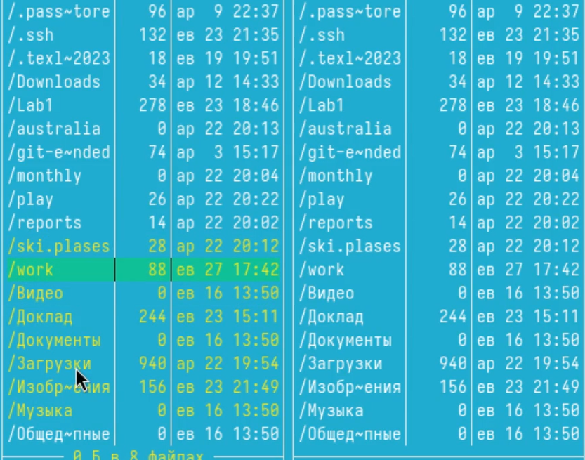{#fig:003}

Через меню Файл скопируем каталог (рис. [-@fig:004]).

{#fig:004}

Через меню Файл переместим каталог  (рис. [-@fig:005]).

{#fig:005}

Откроем через правую панель информацию (рис. [-@fig:006]).

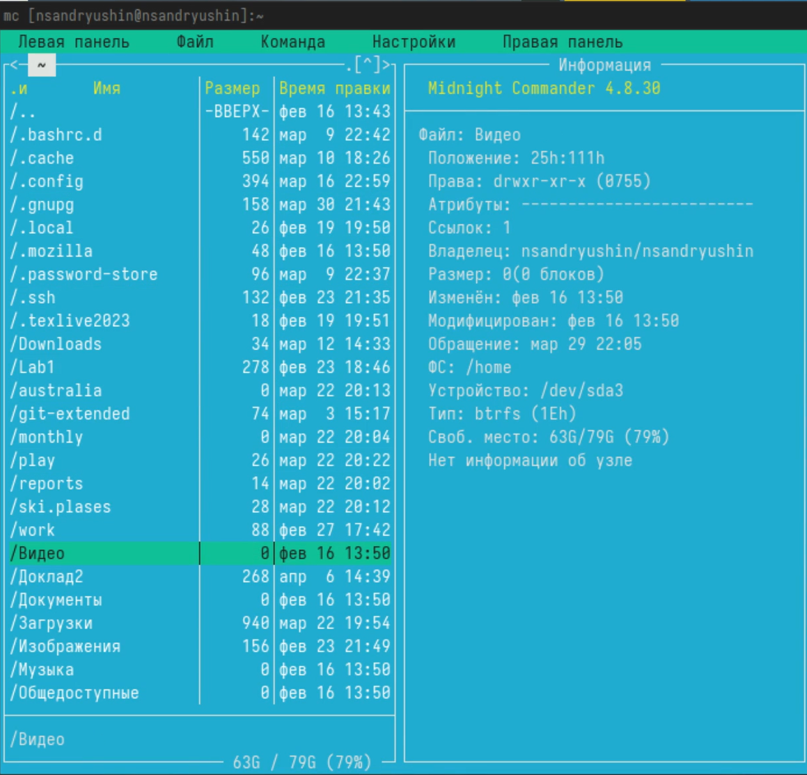{#fig:006}

Откроем через правую панель быстрый просмотр (рис. [-@fig:007]).

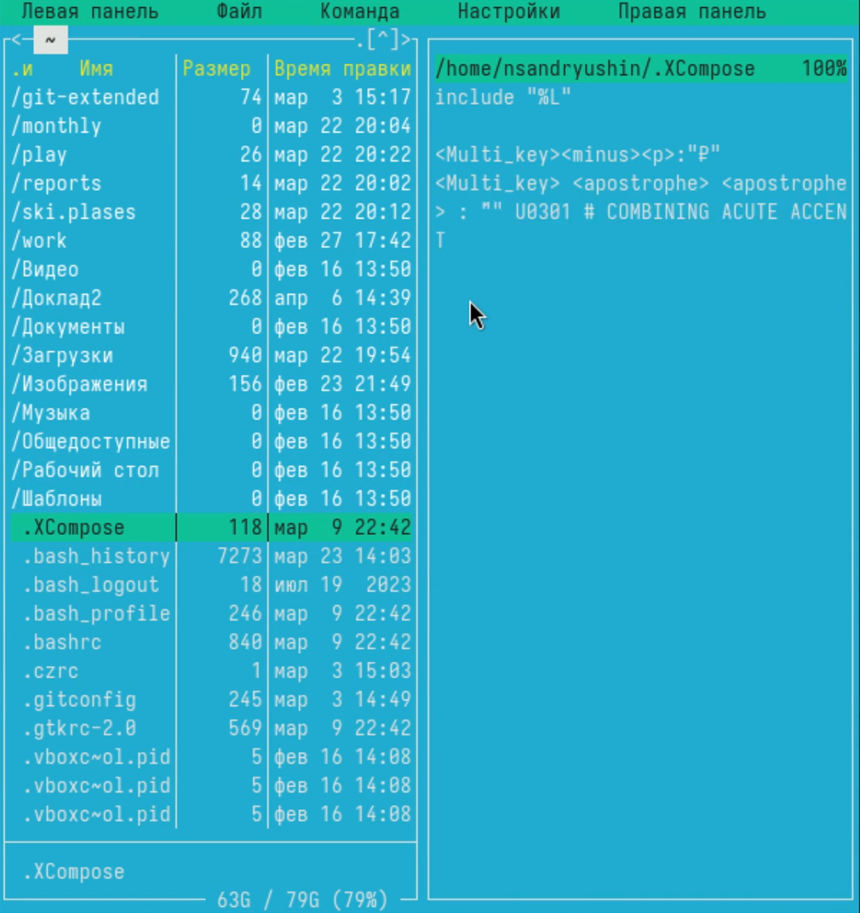{#fig:007}

Откроем через правую панель древо каталогов (рис. [-@fig:008]).

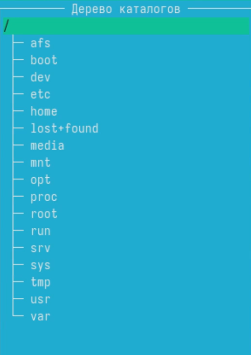{#fig:008}

С помощью F3 просмотрим содержимое файла (рис. [-@fig:009]).

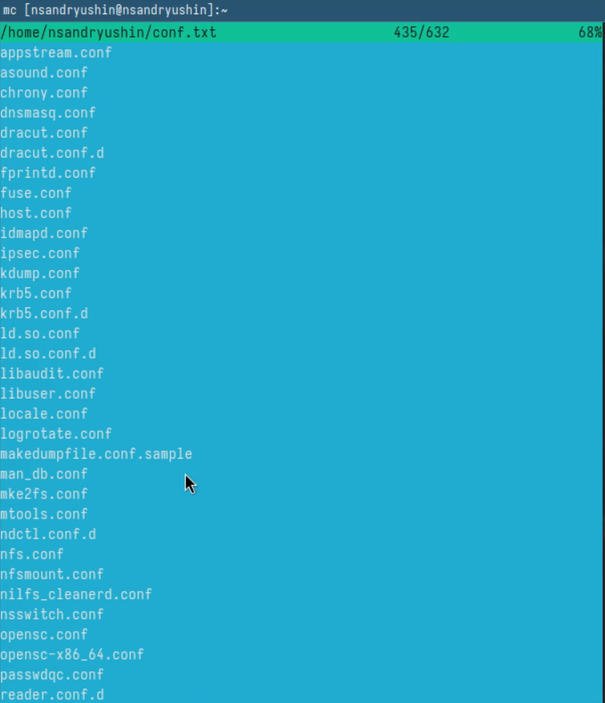{#fig:009}

С помощью F4 отредактируем файл (рис. [-@fig:010]).

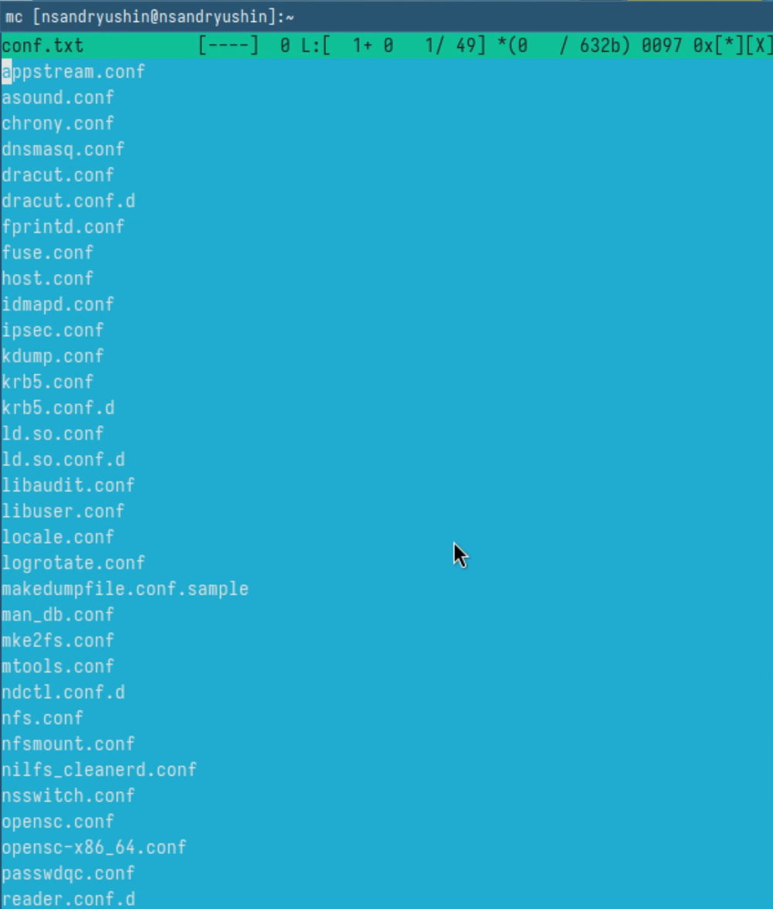{#fig:010}

Создадим каталог через меню Команда (рис. [-@fig:011]).

{#fig:011}

Скопируем каталог через меню Команда (рис. [-@fig:012]).

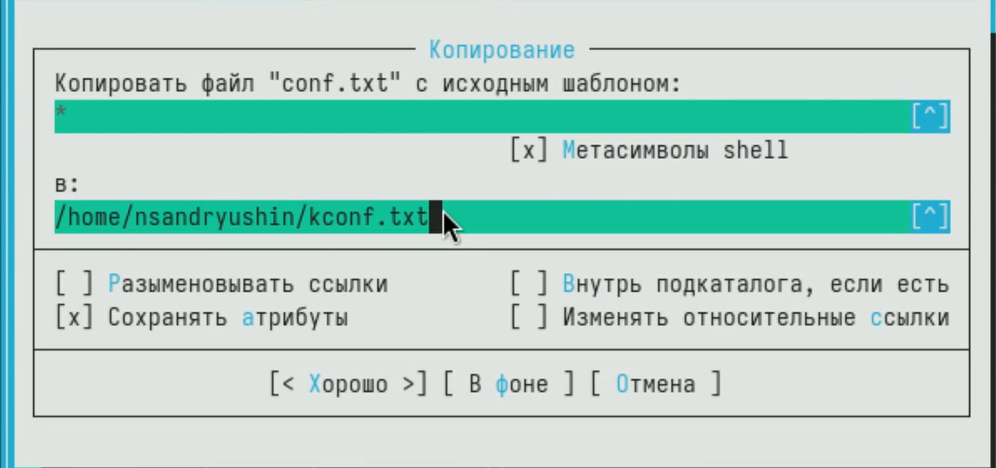{#fig:012}

Найдём файл .txt, содержащий .d через меню Команда (рис. [-@fig:013]).

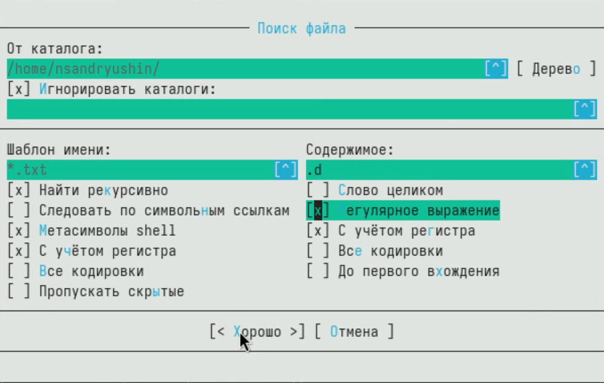{#fig:013}

Откроем через Команда историю, и выполним какую-нибудь команду оттуда (рис. [-@fig:014]).

{#fig:014}

Через Команда откроем каталоги быстрого доступа, где выберем домашний каталог, чтобы быстро перейти в него (рис. [-@fig:015]).

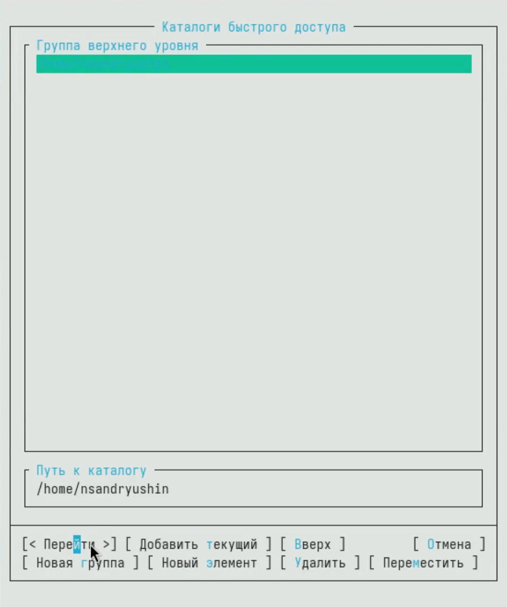{#fig:015}

Откроем файл расширений (рис. [-@fig:016]).

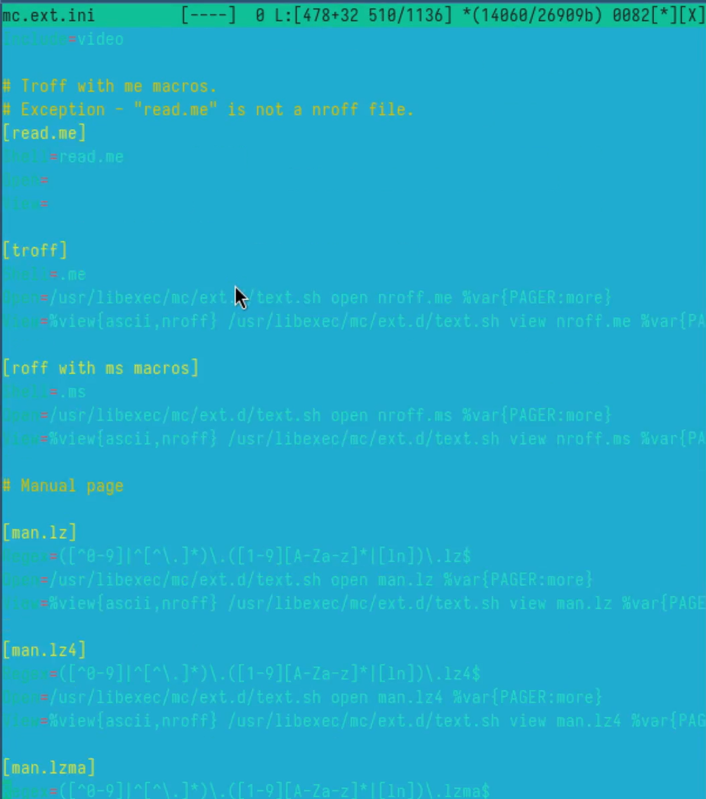{#fig:016}

Откроем файл меню (рис. [-@fig:017]).

{#fig:017}

Посмотрим настройки (рис. [-@fig:018]).

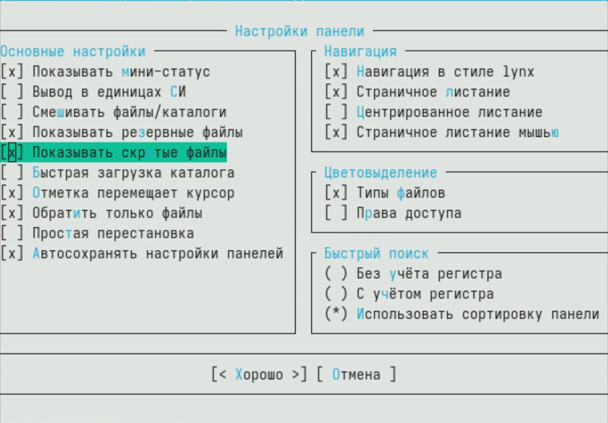{#fig:018}

Создадим файл и вставим в него что-нибудь (рис. [-@fig:019]).

{#fig:019}

Удалим строку через ctrl + u (рис. [-@fig:020]).

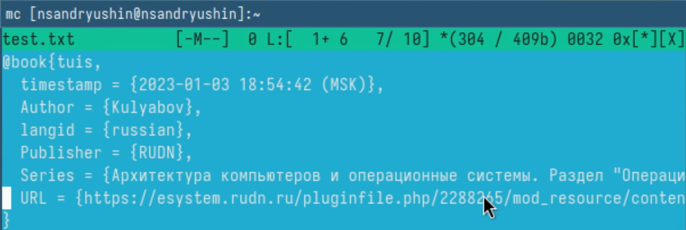{#fig:020}

Переместим строку через F6 (рис. [-@fig:021]).

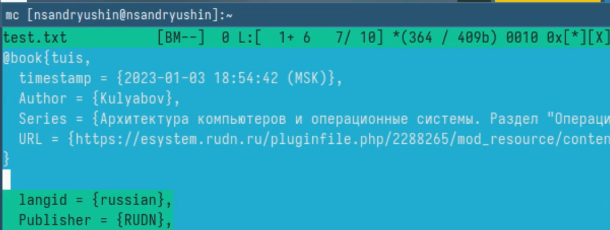{#fig:021}

Скопируем строку через F5 (рис. [-@fig:022]).

{#fig:022}

Отменим действие через ctrl + u (рис. [-@fig:023]).

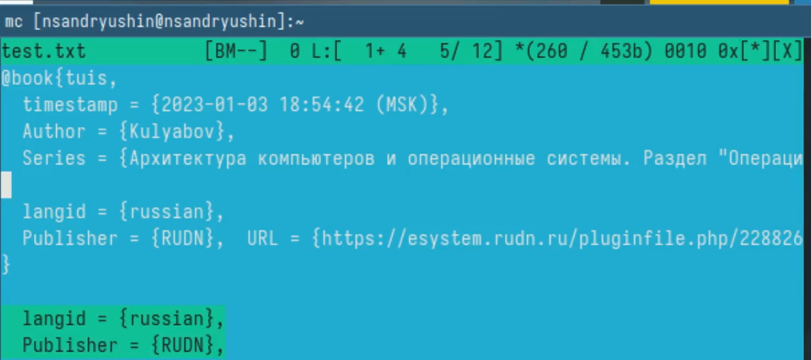{#fig:023}

Напишем что-нибудь в начале и в конце файла (рис. [-@fig:024]).

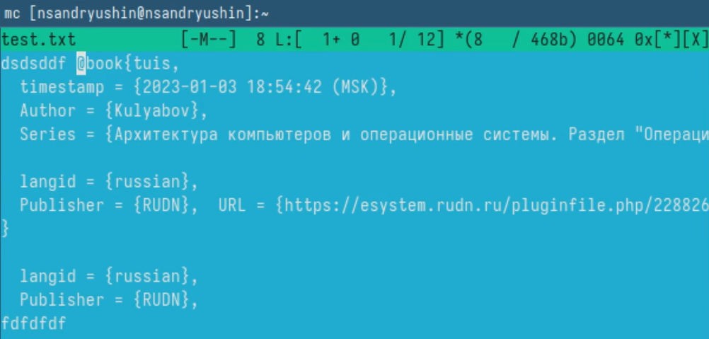{#fig:024}

И откроем какой-нибудь исходный код, где включим подцветку синтаксиса через ctrl + s (рис. [-@fig:025]).

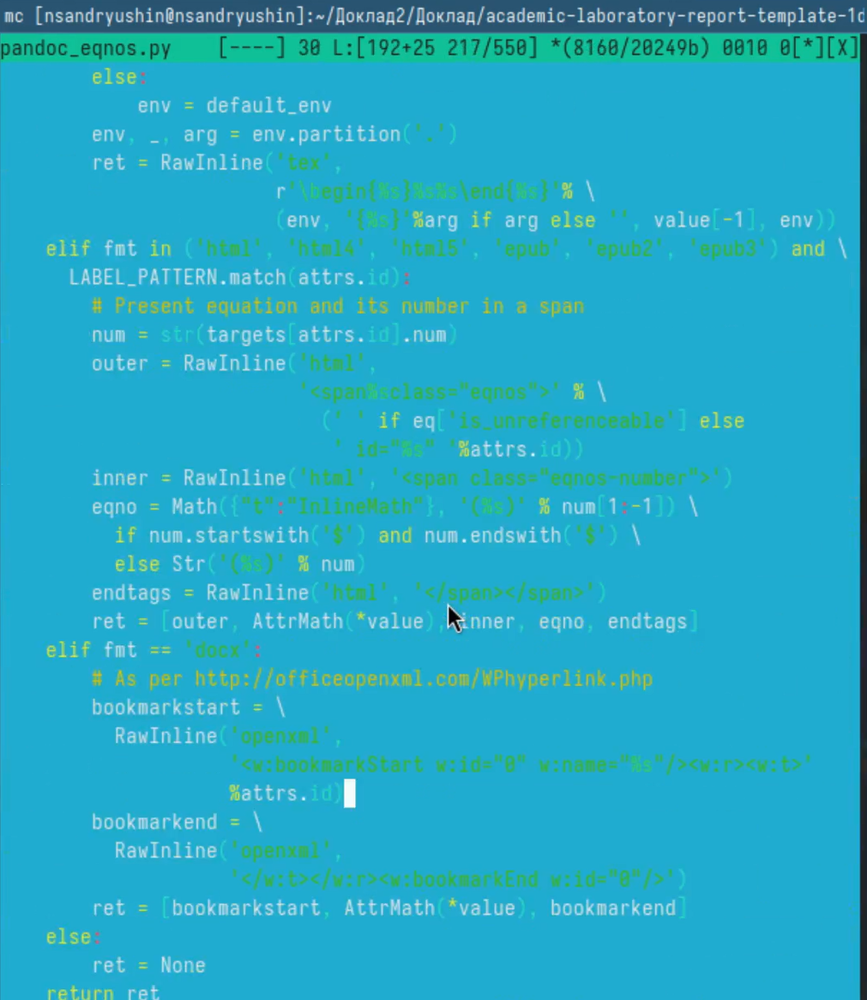{#fig:025}

# Выводы

В результате выполнения лабораторной работы появились навыки работы с mc

# Контрольные вопросы

1. Панели также могут быть настроены для отображения информации в одном из двух режимов: "Информация" или "Дерево". В режиме "Информация" на панели отображаются данные о текущем файле и файловой системе, на которой расположены активные панели. В режиме "Дерево", на одной из панелей отображается структура дерева каталогов.  

2. Раздел "Командная строка оболочки (Shell)" содержит список команд и сочетаний клавиш, используемых для ввода и редактирования команд в командной строке оболочки. Большинство этих команд предназначены для быстрого ввода имен файлов и/или каталогов в командную строку (чтобы упростить процесс ввода) или для доступа к истории команд. Клавиши редактирования строк ввода применяются как при редактировании командной строки, так и в других полях ввода, которые появляются в различных запросах программы.  

3. В меню каждой из панелей (левой или правой) можно выбрать один из следующих форматов списка:  
Стандартный: отображает список файлов и каталогов с указанием их размера и времени последнего изменения.  
Ускоренный: позволяет задать количество столбцов, на которые разбивается панель при выводе списка имен файлов или каталогов без дополнительной информации.  
Расширенный: помимо названия файла или каталога выводит дополнительные сведения о правах доступа, владельце, группе, размере и времени последнего изменения.  
Определённый пользователем: предоставляет пользователю возможность выбрать, какие дополнительные сведения о файле или каталоге следует отобразить.  

4. Просмотр (F3): Позволяет просмотреть содержимое текущего (или выделенного) файла без возможности редактирования.  
Просмотр вывода команды (M + !): Запускает команду с параметрами (аргумент к текущему выбранному файлу) и позволяет просмотреть её вывод.  
Правка (F4): Открывает текущий (или выделенный) файл для редактирования.  
Копирование (F5): Копирует один или несколько файлов или каталогов в указанное пользователем место.  
Права доступа (Ctrl-x c): Позволяет указать (или изменить) права доступа к одному или нескольким файлам или каталогам.  
Жёсткая ссылка (Ctrl-x l): Создает жёсткую ссылку на текущий (или выделенный) файл.  
Символическая ссылка (Ctrl-x s): Создает символическую ссылку на текущий (или выделенный) файл.  
Владелец/группа (Ctrl-x o): Позволяет задать (или изменить) владельца и имя группы для одного или нескольких файлов или каталогов.  
Права (расширенные): Позволяет изменить расширенные права доступа и владение для одного или нескольких файлов или каталогов.  
Переименование (F6): Позволяет переименовать (или переместить) один или несколько файлов или каталогов.  
Создание каталога (F7): Позволяет создать новый каталог.  
Удалить (F8): Позволяет удалить один или несколько файлов или каталогов.  
Выход (F10): Завершает работу Midnight Commander (mc).  

5. Дерево каталогов: Отображает структуру каталогов в системе.  
Поиск файла: Выполняет поиск файлов с заданными параметрами.  
Переставить панели: Меняет местами левую и правую панели.  
Сравнить каталоги (Ctrl-x d): Сравнивает содержимое двух каталогов.  
Размеры каталогов: Отображает размер и время изменения каталога (по умолчанию в MC размер каталога не отображается корректно).  
История командной строки: Выводит список ранее выполненных в оболочке команд.  
Каталоги быстрого доступа (Ctrl-): При вызове выполняется быстрая смена текущего каталога на один из заданных в списке.  
Восстановление файлов: Позволяет восстановить файлы на файловых системах ext2 и ext3.  
Редактировать файл расширений: Позволяет определить действия при запуске файлов с определенным расширением (например, какое программное обеспечение использовать для открытия или редактирования файлов с расширением doc или docx).  
Редактировать файл меню: Позволяет отредактировать контекстное меню пользователя, вызываемое по клавише F2.  
Редактировать файл расцветки имён: Позволяет настроить цветовую схему для имен файлов в зависимости от их типа.  

6. Конфигурация: Позволяет настроить параметры работы с панелями.  
Внешний вид и Настройки панелей: Определяет элементы (строка меню, командная строка, подсказки и т. д.), отображаемые при вызове Midnight Commander (MC), а также геометрию расположения панелей и цветовую схему.  
Биты символов: Задает формат обработки информации локальным терминалом.  
Подтверждение: Позволяет установить или убрать вывод окна с запросом подтверждения действий при операциях удаления и перезаписи файлов, а также при выходе из программы.  
Распознание клавиш: Диалоговое окно используется для тестирования функциональных клавиш, клавиш управления курсором и других клавиатурных комбинаций.  
Виртуальные ФС: Настройки виртуальной файловой системы, такие как тайм-аут, пароль и другие параметры.  

7. F1: Вызов контекстно-зависимой подсказки.  
F2: Вызов пользовательского меню с возможностью создания и/или дополнения дополнительных функций.  
F3: Просмотр содержимого файла, на который указывает подсветка в активной панели (без возможности редактирования).  
F4: Вызов встроенного в MC редактора для изменения содержания файла, на который указывает подсветка в активной панели.  
F5: Копирование одного или нескольких файлов, отмеченных в первой (активной) панели, в каталог, отображаемый на второй панели.  
F6: Перенос одного или нескольких файлов, отмеченных в первой (активной) панели, в каталог, отображаемый на второй панели.  
F7: Создание подкаталога в каталоге, отображаемом в активной панели.  
F8: Удаление одного или нескольких файлов (или каталогов), отмеченных в первой (активной) панели файлов.  
F9: Вызов меню MC.  
F10: Выход из MC.  

8. Ctrl-y: Удалить строку.  
Ctrl-u: Отмена последней операции.  
Ins: Вставка/замена.  
F7: Поиск (можно использовать регулярные выражения).  
Стрелка вверх + F7: Повтор последней операции поиска.  
F4: Замена.  
F3 (первое нажатие): Начало выделения, (второе нажатие): Окончание выделения.  
F5: Копировать выделенный фрагмент.  
F6: Переместить выделенный фрагмент.  
F8: Удалить выделенный фрагмент.  
F2: Записать изменения в файл.  
F10: Выйти из редактора.  

9. Вы можете создавать пользовательские команды для быстрого вызова на панели Midnight Commander. Для этого просто введите команду в строке ввода (в разделе "Команда") и нажмите кнопку "Добавить". Затем введите информативное имя для этой команды. В следующий раз вам будет достаточно выбрать это имя из списка, чтобы вызвать команду, вместо того чтобы вводить всю команду заново.  

10. Панель в Midnight Commander (mc) отображает список файлов текущего каталога. Абсолютный путь к этому каталогу отображается в заголовке панели. Активная панель выделяется подсветкой в заголовке и одной из её строк. Управление панелями осуществляется с помощью определённых комбинаций клавиш или пунктов меню в Midnight Commander.

# Список литературы{.unnumbered}

::: {#refs}
:::
