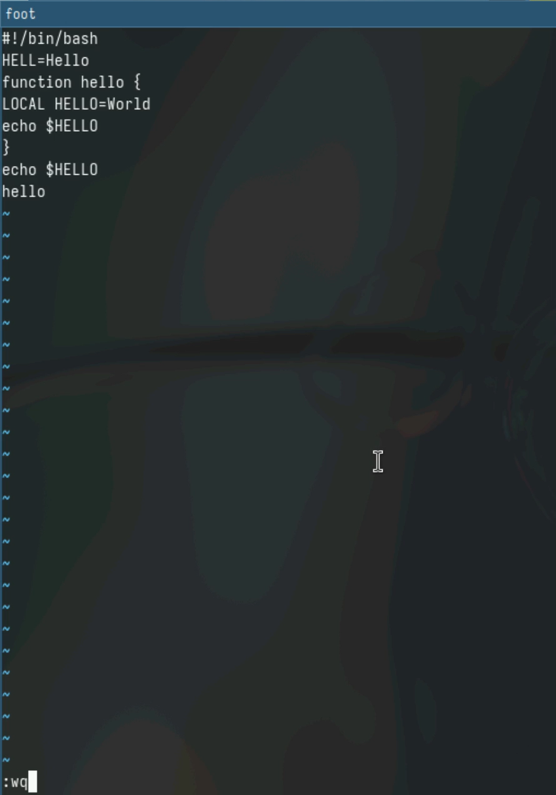
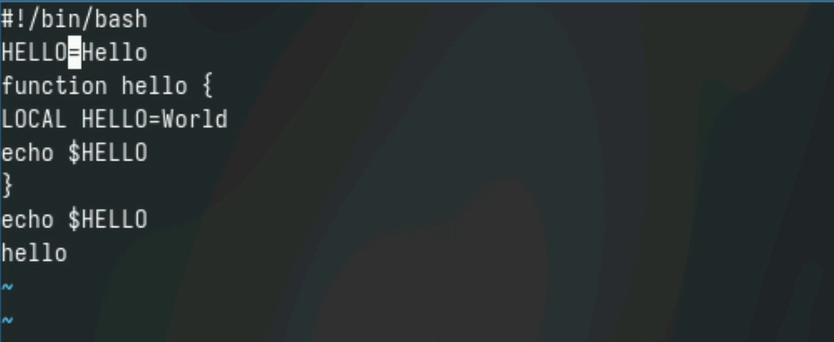
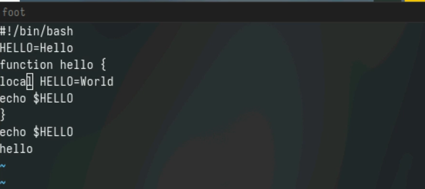
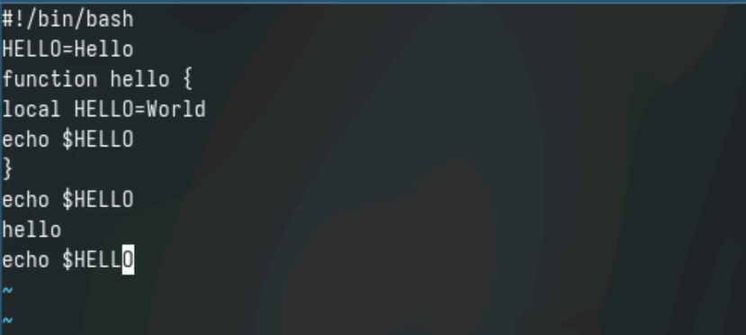
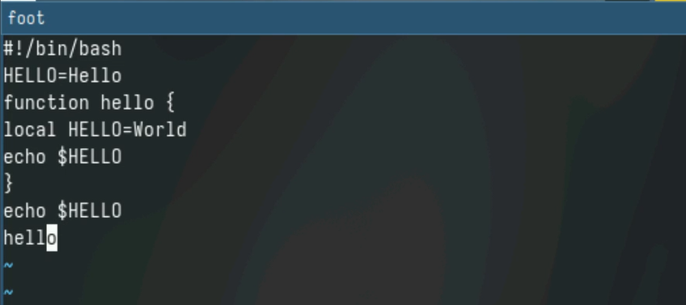
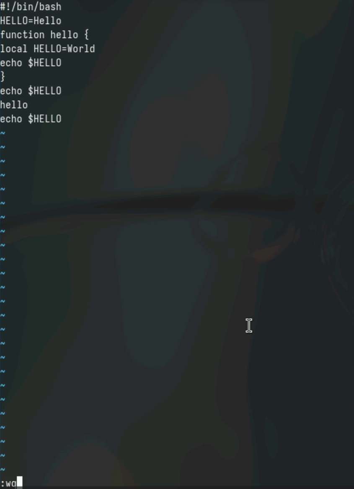

---
## Front matter
title: "Лабораторная работа №10"
subtitle: "Отчёт"
author: "Андрюшин Никита Сергеевич"

## Generic otions
lang: ru-RU
toc-title: "Содержание"

## Bibliography
bibliography: bib/cite.bib
csl: pandoc/csl/gost-r-7-0-5-2008-numeric.csl

## Pdf output format
toc: true # Table of contents
toc-depth: 2
lof: true # List of figures
lot: true # List of tables
fontsize: 12pt
linestretch: 1.5
papersize: a4
documentclass: scrreprt
## I18n polyglossia
polyglossia-lang:
  name: russian
  options:
	- spelling=modern
	- babelshorthands=true
polyglossia-otherlangs:
  name: english
## I18n babel
babel-lang: russian
babel-otherlangs: english
## Fonts
mainfont: PT Serif
romanfont: PT Serif
sansfont: PT Sans
monofont: PT Mono
mainfontoptions: Ligatures=TeX
romanfontoptions: Ligatures=TeX
sansfontoptions: Ligatures=TeX,Scale=MatchLowercase
monofontoptions: Scale=MatchLowercase,Scale=0.9
## Biblatex
biblatex: true
biblio-style: "gost-numeric"
biblatexoptions:
  - parentracker=true
  - backend=biber
  - hyperref=auto
  - language=auto
  - autolang=other*
  - citestyle=gost-numeric
## Pandoc-crossref LaTeX customization
figureTitle: "Рис."
tableTitle: "Таблица"
listingTitle: "Листинг"
lofTitle: "Список иллюстраций"
lotTitle: "Список таблиц"
lolTitle: "Листинги"
## Misc options
indent: true
header-includes:
  - \usepackage{indentfirst}
  - \usepackage{float} # keep figures where there are in the text
  - \floatplacement{figure}{H} # keep figures where there are in the text
---

# Цель работы

Познакомиться с операционной системой Linux. Получить практические навыки работы с редактором vi, установленным по умолчанию практически во всех дистрибутивах [@tuis]

# Задание

Выполнить 2 задачи из файла лабораторной работы

# Выполнение лабораторной работы

Создадим каталог lab10, в котором с помощью vi создадим скриптовый файл hello.sh (рис. [-@fig:001]).

{#fig:001}

Файл сразу же откроется в vi. Перейдём с помощью клавиши i в режим вставки и вставим следующий текст. Далее, нажмём ":" и напишем wq для сохранения файла и выхода (рис. [-@fig:002]).

{#fig:002}

Сделаем файл исполняемым (рис. [-@fig:003]).

{#fig:003}

Снова откроем через vi наш файл (рис. [-@fig:004]).

{#fig:004}

С помощью стрелочек перейдём на конец слова HELLO и перейдём в режим вставки. Допишем букву "O" (рис. [-@fig:005]).

{#fig:005}

Теперь перейдём на 4ую строку, где заменим LOCAL на local (рис. [-@fig:006]).

{#fig:006}

Вствим в конец файла строчку (рис. [-@fig:007]).

{#fig:007}

Теперь сотрём её (рис. [-@fig:008]).

{#fig:008}

Теперь перейдём в командный режим и нажмём "u", чтобы отменить последнее действие (стирание). Теперь сохраним с помощью :wq наш файл (рис. [-@fig:009]).

{#fig:009}

# Выводы

В результате выполнения лабораторной работы были получаны навыки работы с текстовым редактором vi

# Контрольные вопросы

1. Режим команд - служит для ввода команд редактирования и перемещения по редактируемому файлу.  
Режим вставки - предназначен для добавления текста в редактируемый файл.  
Режим командной строки (или последней строки) - используется для сохранения внесенных изменений в файл и выхода из редактора.  
2. Если вам нужно выйти из редактора без сохранения, вы можете просто нажать клавишу "q" (или "q!").  
3. "0" (ноль) — перемещение к началу текущей строки  
"$" — перемещение к концу текущей строки  
"G" — перемещение к концу файла  
"n G" — перемещение к строке с номером n  
4. Редактор vi определяет слово как последовательность символов, состоящую из букв, цифр и символов подчеркивания.  
5. С помощью команды "G" вы перемещаетесь в конец файла в редакторе vi.  
6. Вставка текста:  
"а" - вставить текст после текущего курсора;  
"А" - вставить текст в конец текущей строки;  
"i" - вставить текст перед текущим курсором;  
"n i" - вставить текст n раз;  
"I" - вставить текст в начало текущей строки.  
Вставка строки:  
"о" - вставить строку под текущим курсором;  
"О" - вставить строку над текущим курсором.  
Удаление текста:  
"x" - удалить один символ и поместить его в буфер обмена;  
"d w" - удалить одно слово и поместить его в буфер обмена;  
"d $" - удалить текст от текущего курсора до конца строки и поместить его в буфер обмена;  
"d 0" - удалить текст от начала строки до текущего курсора и поместить его в буфер обмена;  
"d d" - удалить текущую строку и поместить её в буфер обмена;  
"n d d" - удалить n строк и поместить их в буфер обмена.
Отмена и повтор изменений:  
"u" - отменить последнее изменение;  
"." - повторить последнее изменение.  
Копирование текста в буфер обмена:  
"Y" - скопировать текущую строку в буфер обмена;  
"n Y" - скопировать n строк в буфер обмена;  
"y w" - скопировать текущее слово в буфер обмена.  
Вставка текста из буфера обмена:  
"p" - вставить текст из буфера обмена после текущего курсора;  
"P" - вставить текст из буфера обмена перед текущим курсором.  
Замена текста:  
"c w" - заменить текущее слово;  
"n c w" - заменить n слов;  
"c $" - заменить текст от текущего курсора до конца строки;  
"r" - заменить текущий символ;  
"R" - перейти в режим замены текста.  
Поиск текста:  
"/ текст" - выполнить поиск вперёд по указанному тексту;  
"? текст" - выполнить поиск назад по указанному тексту.  
7. Для вставки символов "\$" в редакторе vi следует перейти в режим вставки, нажав клавишу "i", а затем ввести нужное количество символов "$". После завершения вставки символов следует вернуться в командный режим, нажав клавишу "Esc".  
8. Используя команду "u" в редакторе vi, можно отменить последнее совершенное изменение.  
9. В редакторе vi режим последней строки используется для сохранения изменений в файле и выхода из редактора.  
10. Символ "$" в редакторе vi обозначает команду перехода в конец текущей строки.  
11. Опции редактора vi позволяют настраивать рабочую среду. Для установки опций используется команда "set" в режиме последней строки:  
": set all" - выводит полный список опций;  
": set nu" - отображает номера строк;  
": set list" - отображает невидимые символы;  
": set ic" - при поиске не учитывает регистр символов.  
12. В редакторе vi существуют два основных режима: командный режим и режим вставки. По умолчанию работа начинается в командном режиме. В режиме вставки клавиатура используется для ввода текста. Для перехода обратно в командный режим используется клавиша Esc или комбинация клавиш Ctrl + c.  
13. Режим последней строки <> командный режим <> режим ввода  

# Список литературы{.unnumbered}

::: {#refs}
:::
