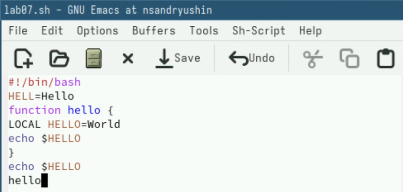
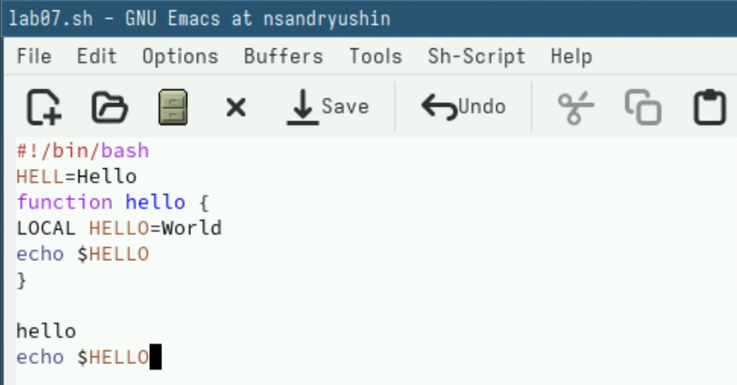
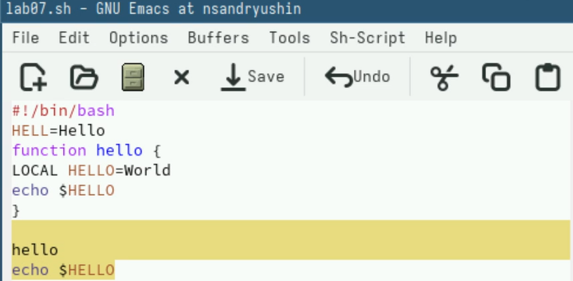
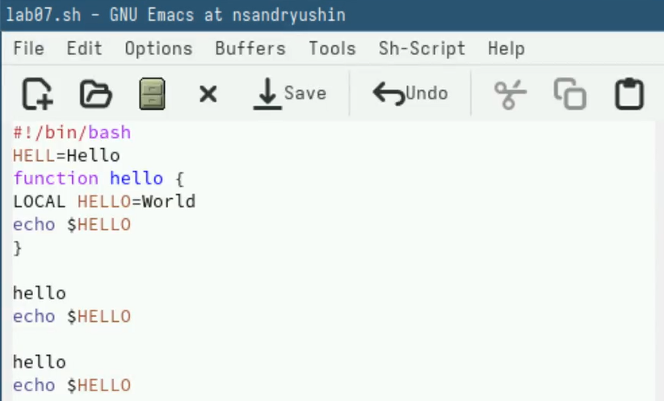
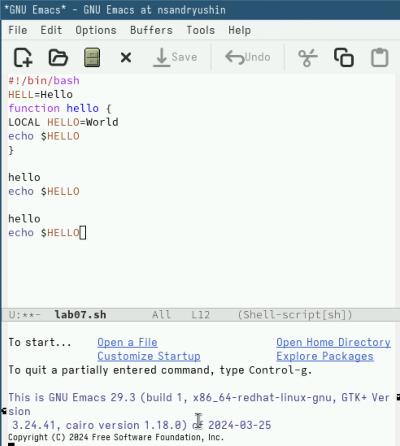
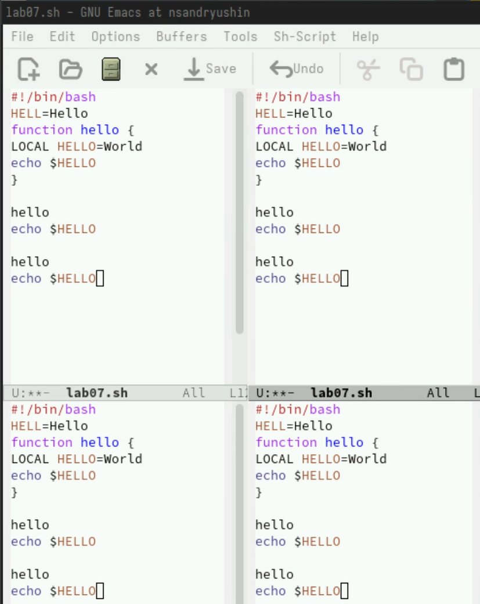
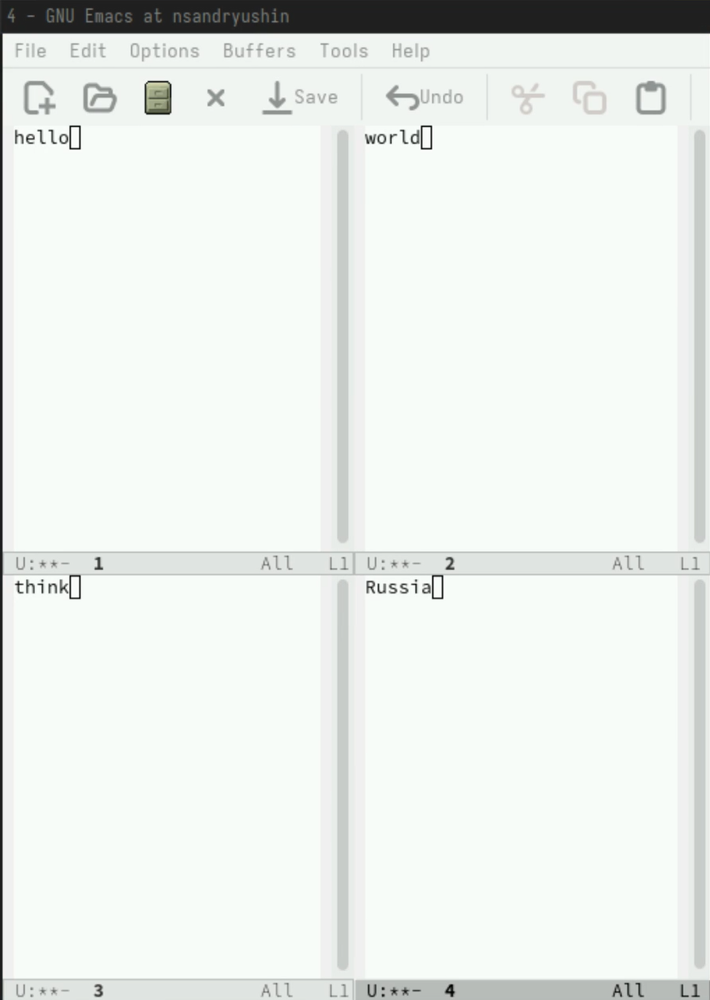
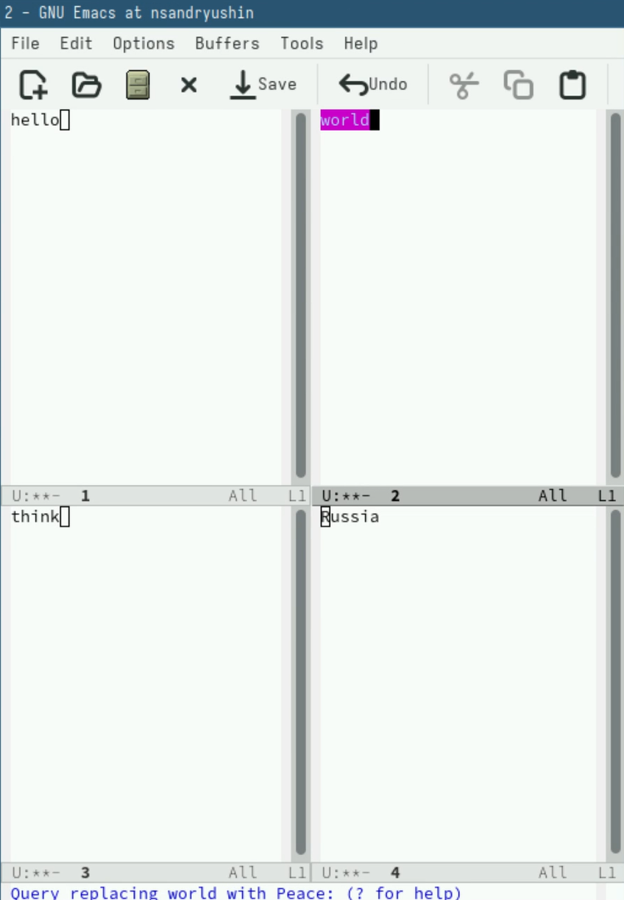

---
## Front matter
title: "Лабораторная работа №11"
subtitle: "Отчёт"
author: "Андрюшин Никита Сергеевич"

## Generic otions
lang: ru-RU
toc-title: "Содержание"

## Bibliography
bibliography: bib/cite.bib
csl: pandoc/csl/gost-r-7-0-5-2008-numeric.csl

## Pdf output format
toc: true # Table of contents
toc-depth: 2
lof: true # List of figures
lot: true # List of tables
fontsize: 12pt
linestretch: 1.5
papersize: a4
documentclass: scrreprt
## I18n polyglossia
polyglossia-lang:
  name: russian
  options:
	- spelling=modern
	- babelshorthands=true
polyglossia-otherlangs:
  name: english
## I18n babel
babel-lang: russian
babel-otherlangs: english
## Fonts
mainfont: PT Serif
romanfont: PT Serif
sansfont: PT Sans
monofont: PT Mono
mainfontoptions: Ligatures=TeX
romanfontoptions: Ligatures=TeX
sansfontoptions: Ligatures=TeX,Scale=MatchLowercase
monofontoptions: Scale=MatchLowercase,Scale=0.9
## Biblatex
biblatex: true
biblio-style: "gost-numeric"
biblatexoptions:
  - parentracker=true
  - backend=biber
  - hyperref=auto
  - language=auto
  - autolang=other*
  - citestyle=gost-numeric
## Pandoc-crossref LaTeX customization
figureTitle: "Рис."
tableTitle: "Таблица"
listingTitle: "Листинг"
lofTitle: "Список иллюстраций"
lotTitle: "Список таблиц"
lolTitle: "Листинги"
## Misc options
indent: true
header-includes:
  - \usepackage{indentfirst}
  - \usepackage{float} # keep figures where there are in the text
  - \floatplacement{figure}{H} # keep figures where there are in the text
---

# Цель работы

Познакомиться с операционной системой Linux. Получить практические навыки работы с редактором Emacs [@tuis]

# Задание

Ознакомиться с теоретическим материалом.
Ознакомиться с редактором emacs.
Выполнить упражнения.
Ответить на контрольные вопросы.

# Выполнение лабораторной работы

Откроем emacs и через ctrl x ctrl f создадим новый файл lab07.sh (рис. [-@fig:001]).

{#fig:001}

Вставим в него следующий код (рис. [-@fig:002]).

{#fig:002}

Вырежим строчку через C-k (рис. [-@fig:003]).

{#fig:003}

Теперь вставим её через C-y (рис. [-@fig:004]).

{#fig:004}

Теперь выделим часть кода через C-space (рис. [-@fig:005]).

{#fig:005}

Скопируем выделенный код через M-w и вставим через C-y (рис. [-@fig:006]).

{#fig:006}

Теперь выделим эту область и вырежем её (рис. [-@fig:007]).

{#fig:007}

Теперь отменим последнее действие через C-/ (рис. [-@fig:008]).

{#fig:008}

Через C-x C-b выведем список буферов (рис. [-@fig:009]).

{#fig:009}

Теперь переключимся на другой буфер (рис. [-@fig:010]).

{#fig:010}

Закрытие буфера и переход на другой буфер через горячие клавиши C-x b (рис. [-@fig:011]).

{#fig:011}

Делим фрейм на 4 части с помощью C-x 3 и C-x 2 (рис. [-@fig:012]).

{#fig:012}

Создадим 4 файла, откроем их в 4ёх частях фрейма и напишем в них разный текст (рис. [-@fig:013]).

{#fig:013}

Поспользуемся поиском C-s (рис. [-@fig:014]).

{#fig:014}

Перейдём в режим поиска и замены с помощью M-% и заменим слово world на peace (рис. [-@fig:015]).

{#fig:015}

Используем другой режим поиска через M-s o. Он выводит в отдельном окне все вхождения слова (рис. [-@fig:016]).

{#fig:016}

# Выводы

В результате выполнения лабораторной работы были получены навыки работы с текстовым редактором emacs

# Список литературы{.unnumbered}

::: {#refs}
:::
