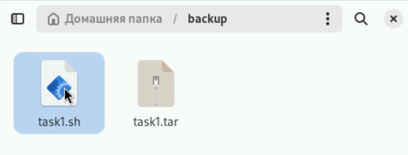
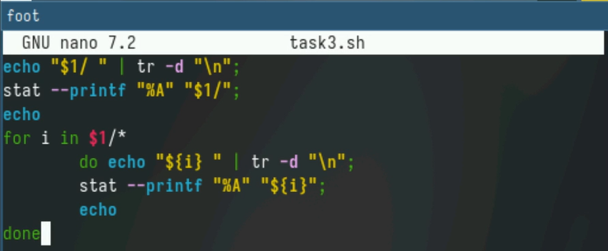
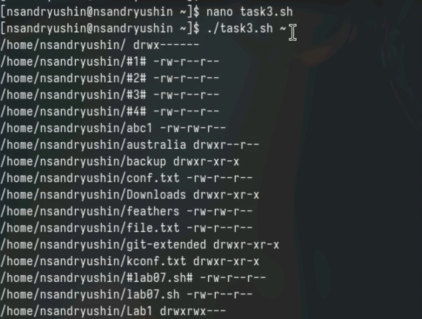

---
## Front matter
lang: ru-RU
title: Лабораторная работа №12
subtitle: Презентация
author:
  - Андрюшин Н. С.
institute:
  - Российский университет дружбы народов, Москва, Россия
date: 12 марта 2024

## i18n babel
babel-lang: russian
babel-otherlangs: english

## Formatting pdf
toc: false
toc-title: Содержание
slide_level: 2
aspectratio: 169
section-titles: true
theme: metropolis
header-includes:
 - \metroset{progressbar=frametitle,sectionpage=progressbar,numbering=fraction}
 - '\makeatletter'
 - '\beamer@ignorenonframefalse'
 - '\makeatother'
 
## Fonts
mainfont: PT Serif
romanfont: PT Serif
sansfont: PT Sans
monofont: PT Mono
mainfontoptions: Ligatures=TeX
romanfontoptions: Ligatures=TeX
sansfontoptions: Ligatures=TeX,Scale=MatchLowercase
monofontoptions: Scale=MatchLowercase,Scale=0.9
---

# Информация

## Докладчик

:::::::::::::: {.columns align=center}
::: {.column width="70%"}

  * Андрюшин Никита Сергеевич
  * Студент
  * Российский университет дружбы народов
  * [1132231848@pfur.ru](mailto:1132231848@pfur.ru)

:::
::: {.column width="30%"}

:::
::::::::::::::

## Цель

Изучить основы программирования в оболочке ОС UNIX/Linux. Научиться писать небольшие командные файлы

## Задачи

1. Написать скрипт, который при запуске будет делать резервную копию самого себя (то есть файла, в котором содержится его исходный код) в другую директорию backup в вашем домашнем каталоге. При этом файл должен архивироваться одним из архиваторов на выбор zip, bzip2 или tar. Способ использования команд архивации необходимо узнать, изучив справку.
2. Написать пример командного файла, обрабатывающего любое произвольное число аргументов командной строки, в том числе превышающее десять. Например, скрипт может последовательно распечатывать значения всех переданных аргументов.

## Задачи

3. Написать командный файл — аналог команды ls (без использования самой этой команды и команды dir). Требуется, чтобы он выдавал информацию о нужном каталоге и выводил информацию о возможностях доступа к файлам этого каталога.
4. Написать командный файл, который получает в качестве аргумента командной строки формат файла (.txt, .doc, .jpg, .pdf и т.д.) и вычисляет количество таких файлов в указанной директории. Путь к директории также передаётся в виде аргумента командной строки.

## Код первой программы

Напишем код первой программы

## Проверка работы первой программы

И проверим работу

## Код второй программы

Напишем код второй программы

## Проверка работы второй программы

И проверим работу

{height=70%}

## Код третьей программы

Напишем код третьей программы

{height=70%}

## Проверка работы третьей программы

И проверим работу

{height=70%}

## Код четвёртой программы

Напишем код четвёртой программы

## Проверка работы четвёртой программы

И проверим работу

## Выводы

В результате выполнения лабораторной работы были получены навыки написания скриптовых файлов
