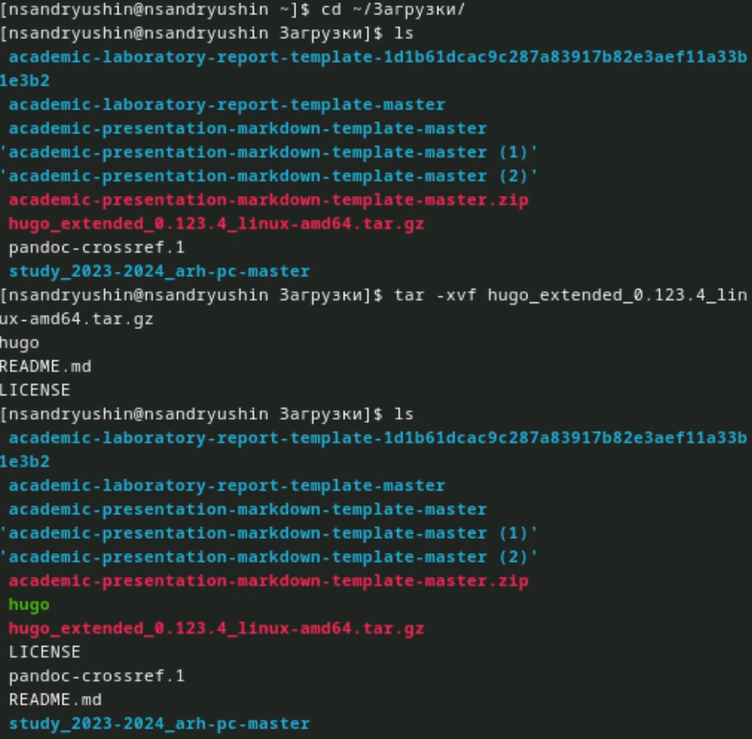
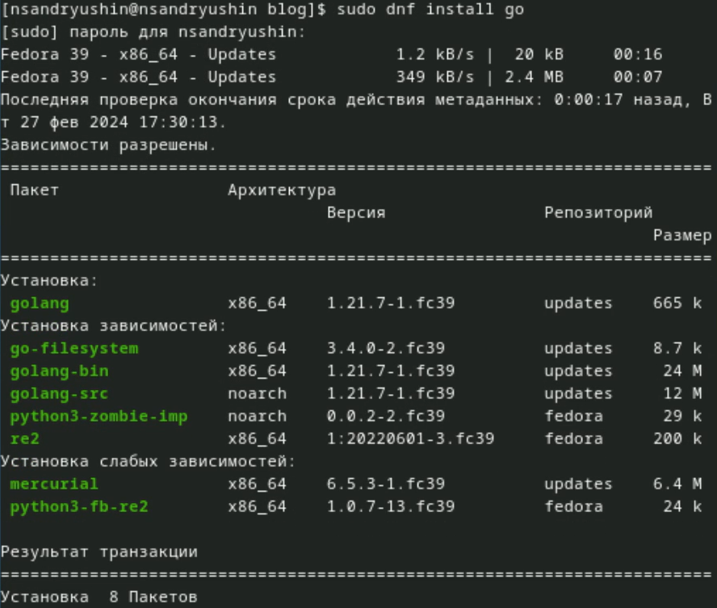
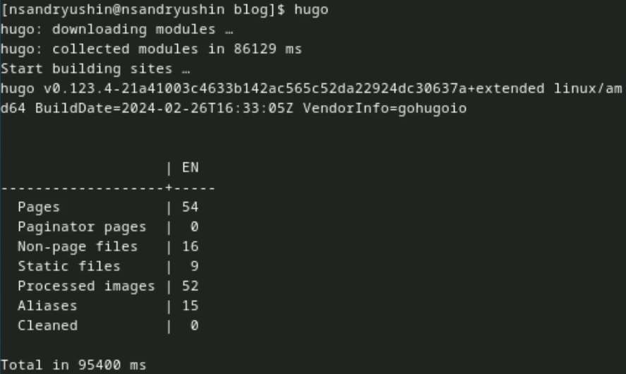
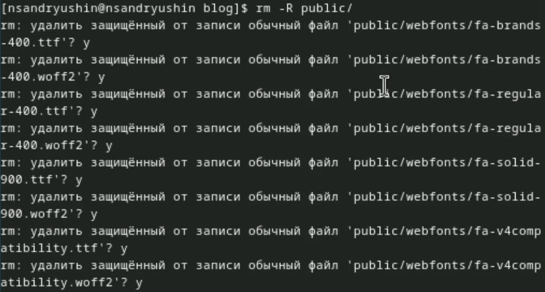
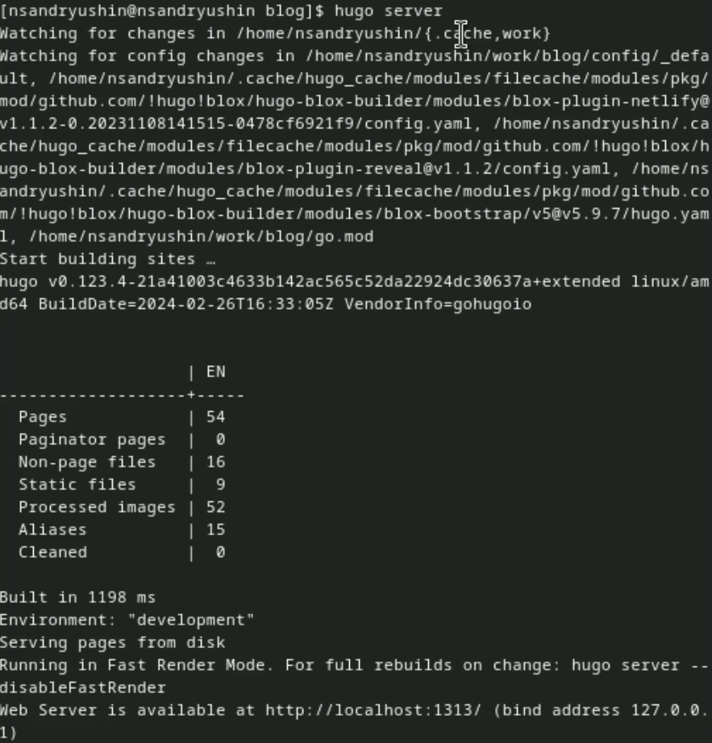
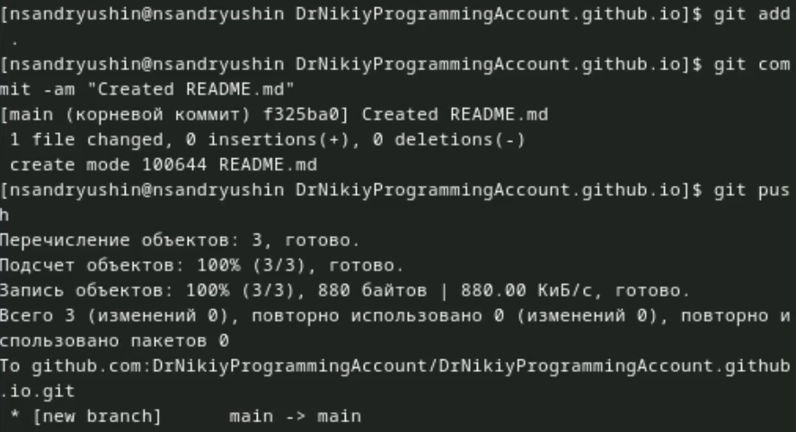
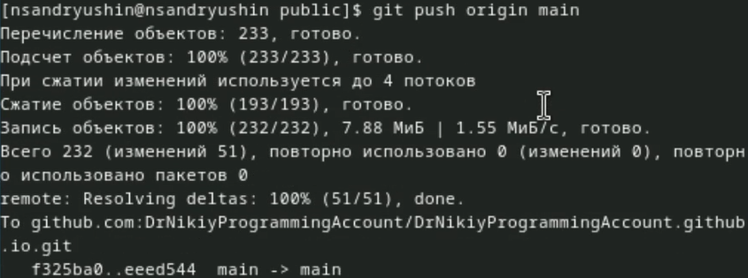

---
## Front matter
title: "Отчёт по индивидуальному проекту"
subtitle: "Часть 1"
author: "Андрюшин Никита Сергеевич"

## Generic otions
lang: ru-RU
toc-title: "Содержание"

## Bibliography
bibliography: bib/cite.bib
csl: pandoc/csl/gost-r-7-0-5-2008-numeric.csl

## Pdf output format
toc: true # Table of contents
toc-depth: 2
lof: true # List of figures
lot: true # List of tables
fontsize: 12pt
linestretch: 1.5
papersize: a4
documentclass: scrreprt
## I18n polyglossia
polyglossia-lang:
  name: russian
  options:
	- spelling=modern
	- babelshorthands=true
polyglossia-otherlangs:
  name: english
## I18n babel
babel-lang: russian
babel-otherlangs: english
## Fonts
mainfont: PT Serif
romanfont: PT Serif
sansfont: PT Sans
monofont: PT Mono
mainfontoptions: Ligatures=TeX
romanfontoptions: Ligatures=TeX
sansfontoptions: Ligatures=TeX,Scale=MatchLowercase
monofontoptions: Scale=MatchLowercase,Scale=0.9
## Biblatex
biblatex: true
biblio-style: "gost-numeric"
biblatexoptions:
  - parentracker=true
  - backend=biber
  - hyperref=auto
  - language=auto
  - autolang=other*
  - citestyle=gost-numeric
## Pandoc-crossref LaTeX customization
figureTitle: "Рис."
tableTitle: "Таблица"
listingTitle: "Листинг"
lofTitle: "Список иллюстраций"
lotTitle: "Список таблиц"
lolTitle: "Листинги"
## Misc options
indent: true
header-includes:
  - \usepackage{indentfirst}
  - \usepackage{float} # keep figures where there are in the text
  - \floatplacement{figure}{H} # keep figures where there are in the text
---

# Цель работы

Научиться создавать сайты с помощью Hugo и размещать их на хостинге github [@tuis]

# Задание

Установить необходимое программное обеспечение.  
Скачать шаблон темы сайта.  
Разместить его на хостинге git.  
Установить параметр для URLs сайта.  
Разместить заготовку сайта на Github pages.

# Выполнение лабораторной работы

Для начала необходимо скачать последнюю версию движка сайтов Hugo для ОС Linux (рис. [-@fig:001])

{#fig:001}

Далее, с помощью утилиты tar распакуем архив с Hugo (рис. [-@fig:002])

{#fig:002}

Установим Hugo, переместив исполняемый файл в директорию /usr/local/bin (рис. [-@fig:003])

{#fig:003}

Зайдём на страницу шаблона для сайта https://github.com/wowchemy/starter-hugo-academic и создадим из неё репозиторий [@github] (рис. [-@fig:004])

{#fig:004}

Назовём наш репозиторий blog (рис. [-@fig:005])

{#fig:005}

И клонируем созданный репозиторий к себе на компьютер (рис. [-@fig:006])

{#fig:006}

Установим язык Go на компьютер, так как он необходим для работы Hugo (рис. [-@fig:007])

{#fig:007}

Запустим Hugo. В момент запуска он подготовит папку с сайтом, создав дополнительные каталоги (рис. [-@fig:008])

{#fig:008}

Удалим папку Public с помощью команды rm, так как пока она нам не нужна (рис. [-@fig:009])

{#fig:009}

Теперь запустим Hugo с опцией server, которая позволит нам запустить наш сайт (рис. [-@fig:010])

{#fig:010}

Перейдя по адресу localhost:1313, мы увидим наш сайт (рис. [-@fig:011])

{#fig:011}

Теперь создадим второй репозиторий, на котором будет висеть наш сайт. Его нужно назвать в формате "Имя аккаунта на гитхаб + .github.io" (рис. [-@fig:012])

{#fig:012}

Теперь клонируем наш пустой репозиторий на компьютер, создадим файл README.md и переключимся на ветку main (рис. [-@fig:013])

{#fig:013}

Обновляем репозиторий, делая коммит и выкладывая изменения на гитхаб (рис. [-@fig:014])

{#fig:014}

Далее, необходимо открыть файл .gitignore и закомментировать папку public (рис. [-@fig:015])

{#fig:015}

Теперь добавим второй репозиторий как сабмодуль первого, и он будет в себе хранить папку public (рис. [-@fig:016])

{#fig:016}

Проверим корректность настройки сабмодуля (рис. [-@fig:017])

{#fig:017}

Теперь сделаем коммит (рис. [-@fig:018])

{#fig:018}

И выгрузим изменения на гитхаб (рис. [-@fig:019])

{#fig:019}

Теперь посмотрим, как выглядит наш сайт, который теперь располагается по адресу https://drnikiyprogrammingaccount.github.io/ (рис. [-@fig:020])

{#fig:020}

# Выводы

В результате выполнения лабораторной работы был создан сайт, который находится на хостинге Github

# Список литературы{.unnumbered}

::: {#refs}
:::
